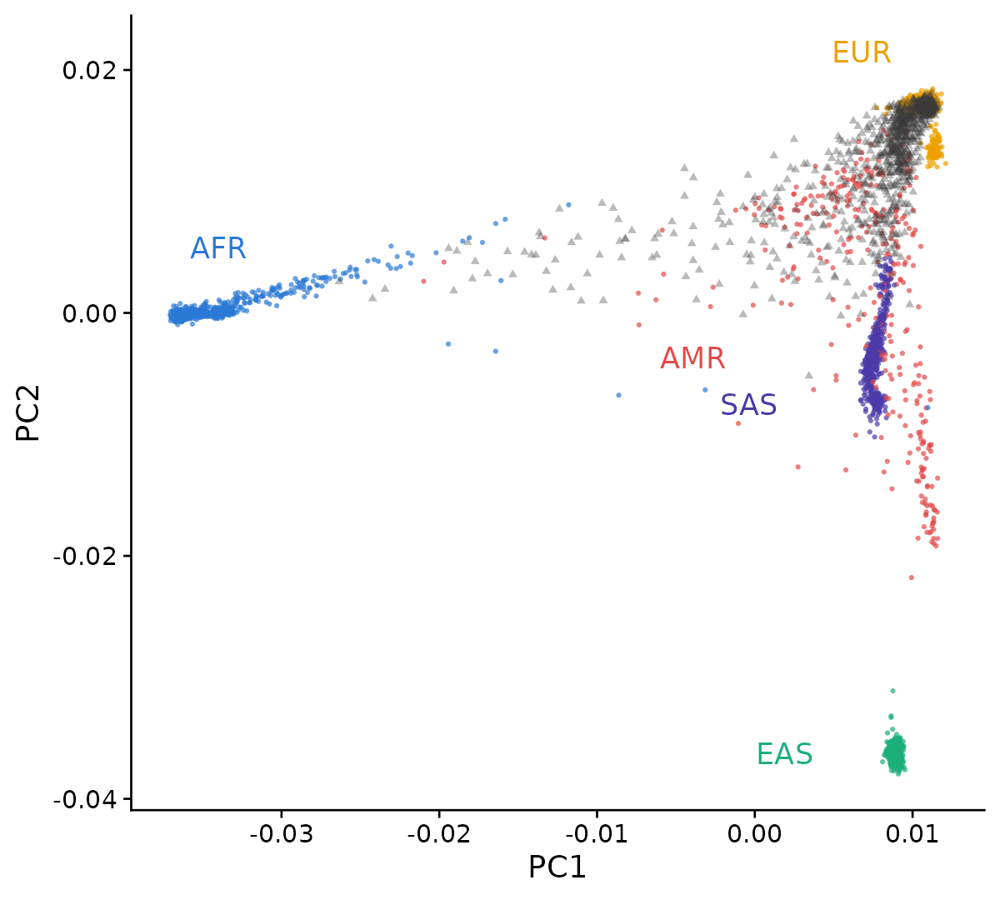

# **From genotype data to polygenic risk scores: a practical end-to-end guide for researchers without bioinformatics training**

**Author: van Zanten, E.S.**


**This GitHub is created alongside our paper on PRS computation for non-bioinformaticians. We go through the pipeline in the order described in the paper, starting with some preparation steps, followed by QC and PRS computation. Note that for generating the figures, we have a separate R script in this repository called figures.R.**  

## Contents

## Quality Control
**1.1 Variant and sample missingness**    
**1.2 Sex concordance**   
**1.3 Preliminary PCA and heterozygosity**  
**1.4 Relatedness**  
**1.5 Strict variant filtering and differential missingness**   
**1.6 Hardy-Weinberg**  
**1.7 MAF**  
**1.8 Variant Harmonization**  
**1.9 Principal Component Analysis**  

## Imputation 

## PRS calculation
  
  

### Preparation 

1. **Software, data and programming languages**  
   Make sure you have the software needed for this pipeline downloaded, see [insert singularity container and point to table]. The coding itself is done in bash, and we make the figures in R [version]. For several of the QC and PRS steps, we need to download genetic data of a reference panel. To choose the right reference panel, we refer to our paper section 4.1.

2. **Input data**  
   This pipeline is built for SNP array data, although some of the steps are also relevant for whole exome sequencing (WES) and whole genome sequencing (WGS). For full WES and WGS pipelines, we recommend using [insert good QC papers]. In our case, we use SNP array data in a variant call format (VCF) file. Our data is derived from a stroke GWAS in 986 Brazilian individuals (513 cases, 473 controls).

3. **Configuration**  
   In many scripts, values are often set multiple times throughout the script, and it is often easier and cleaner to assign these values at the beginning of the script so that if you change the values, you only have to do that once at the beginning of the script. Throughout this pipeline, we assign multiple variables to values:  
   *  For reproducibility, we assign a seed. This means that in steps where randomization is applied, we will get the same results every time we run the script.  
   *  When working on computing clusters, it is advisable to set the number of CPU cores that PLINK may use, since if you do not do this, PLINK will attempt to use all available cores on a node, which may exceed your allocated resources. As a default, we will use 4 threads.  
   *  We also specify the output path that will be used to put all the results in, and the input VCF and metadata (for us, the phenotype textfile that states whether each individual is a case or a control, and what their age and sex is)  

```
SEED=1
THREADS=4
OUT=/path_to_output/
VCF=/path_to_vcf/genotypes.vcf.gz
PHENO=/path_to_metadata/phenotypes.txt
```


### Inspecting your data  

Let's start by inspecting our VCF file and the phenotype data, just to get an idea of what each file looks like. Since we specified the paths to those files above, we just have to reference to them in this step.  

1. First inspect the phenotype data. We do not want to print the entire file, just the first two lines of the beginning of the file is enough (head -n 2 does this)   
```
cat "$PHENO" | head -n 2
```  
|Sample ID|FID|IID|Status|Sex|Age
|---------|---|---|------|---|---|
|00000301 |00000301_2-375928.CEL|00000301_2-375928.CEL|Case|FEMALE|60|
|00000305 |00000305_2-362470.CEL|00000305_2-362470.CEL|Case|MALE  |53|


In our case, the FID (family ID) and IID (individual ID) are the same, since we do not have families in our cohort to our knowledge (spoiler: later in the pipeline, we will find out we do have relatives). The first two individuals are both cases, one is male (aged 53) and one is female (aged 60).  

2. Let's also inspect what the VCF looks like, and what types of variants our VCF contains.  
A VCF is often gzipped (compressed; ending in .gz) since it is very large, and it has a long header that contains specifics on the genotypes (e.g. build, how the VCF was derived). Since we just want to inspect the data itself, we therefore have to use a different command than for the phenotyping file, and BCFtools is designed to do this.  

```
bcftools view -H "$VCF" | head -n 1
```
This skips the header (-H), and shows the data for the first variant. For readability, we just paste the genotypes of the first 4 individuals:
|CHROM|POS|ID|REF|ALT|QUAL|FILTER|INFO|FORMAT|           |
|-----|---|--|---|---|----|------|----|------|-----------|
1     |  86028  | AX-13216142   |  T  |     C    |   .   |    .     |  PR        |      GT  |    0/0     0/0     0/0     0/0 |             

Per column:  
1: chromosome  
86028: position on the chromosome  
AX-13216142: variant ID (in our case, the Axiom assay probe name, not an rsID)  
T: reference allele  
C: alternative allele  
.: quality score (empty, since SNP arrays don't give one)  
.: filter status (empty, no filters applied)  
PR: extra information: here a flag that the reference allele is provisional, we will check this later on in the pipeline  
GT: format of the sample columns: they hold genotypes (GT)  

Genotypes are then counted as follows:  
0/0: two reference alleles (T/T)  
0/1: one reference, one alternative allele (T/C)  
1/1: two alternative alleles (C/C)  
./.: missing, the array failed to call it  

Now we check what kinds of variants, and how many, we have.  
```
bcftools stats "$VCF"
```
This prints a lot of interesting data. For us, the first table is most relevant since it is a summary:  
|SN|[2]id|[3]key|[4]value|  
|--|-----|------|--------|
SN |     0  |     number of samples:   |   986  |
SN |    0    |   number of records:     | 864725 | 
SN  |    0    |   number of no-ALTs:     | 144311 | 
SN   |   0     |number of SNPs: |720414  |
SN     | 0     |  number of MNPs:| 0  |
SN      |0      | number of indels:|       0|  
SN      |0       |number of others: |      0 | 
SN      |0       |number of multiallelic sites:|   0|  
SN      |0       |number of multiallelic SNP sites:  |     0  |

So we have 986 individuals and 864,725 variants, all of them SNPs. The 144,311 "no-ALTs" are SNPs at which everybody in our cohort turned out to have the same genotype, so only one allele was ever seen.

3. We now rewrite the phenotype file into the two columns expected by PLINK. PLINK reads sex as 1 for male and 2 for female, but also accepts the words, so MALE and FEMALE can be passed through unchanged. Case/control status has to become 2 for a case and 1 for a control, which is the part people get backwards most often. Change the column numbers if your file is laid out differently: below, $2 is FID, $3 is IID, $4 is the status and $5 is the sex.
```
awk -F'\t' 'NR==1 {print "#FID\tIID\tSEX\tPHENO"; next}
            {p = ($4=="Case") ? 2 : ($4=="Control") ? 1 : "NA"
             print $2"\t"$3"\t"$5"\t"p}' "$PHENO" > sex_pheno.txt


Now we can use PLINK. Remember to specify the threads and the output directory we put in our configuration! 
plink2 --vcf "$VCF" --double-id \
       --update-sex sex_pheno.txt \
       --pheno sex_pheno.txt --pheno-name PHENO \
       --threads "$THREADS" --make-bed --out "$OUT/first_step"
Here, we first refer to our VCF again, then tell PLINK that the IID and FID are the same. We then update the sex and phenotype status and specify the number of threads PLINK may use. We then generate PLINK files, including a BED, BIM and FAM file (see [insert link] for details on those filetypes). Here, we refer to our output directory for the first time. 

```

What does the result look like?: PLINK tells you what it managed to attach.
For us:
```
1 binary phenotype loaded (513 cases, 473 controls).
--update-sex: 986 samples updated.
```

## Quality Control

### 1.1 Missingness
Missingness is the fraction of genotypes that the array failed to call. It can be counted per variant (a probe that works badly in everyone) or per sample (an error in someones DNA that worked badly for every probe). Both variant and sample missingness need a threshold, and the (default) thresholds used in this pipeline are as follows: 
|Step|Threshold|Removes if missing in more than|Keeps call rate of at least|
|------|----|----|---|
|Variant filter (lenient)|0.2|20% of samples|80%|
|Sample filter|0.02|2% of variants|98%|
|Variant filter (strict)|0.02|2% of samples|98%|  

At this stage, we will first perform the lenient variant filtering and the sample filtering. The strict variant filter will be applied later in the pipeline. 
PLINK applies --mind before --geno when both are given in one command, and we want to do the lenient variant filtering before sample filtering (see paper for detailed explanation on this). 

```
plink2 --bfile "$OUT/first_step" --geno 0.2 --threads "$THREADS" --out "$OUT/lenient_var"
In our data, this excludes 1248 variants

plink2 --bfile "$OUT/lenient_var" --mind 0.02 --threads "$THREADS" --out "$OUT/sample_missingn"
In our data, this excludes 8 samples (individuals)

We are now left with 978 samples and 863477 variants. 

``` 


### 1.2 Sex concordance 
We now check that the sex recorded in the phenotype file matches the sex we can read off the genotypes. A mismatch usually means a sample was swapped somewhere between the clinic and the plate, and a swapped sample carries the wrong phenotype, so it has to go. The check works on the X chromosome. Males have one copy and so cannot be heterozygous on it; females have two and are heterozygous at many positions.
PLINK summarises this as an inbreeding coefficient F, which lands near 1 for males and near 0 for females. Below we call F < 0.2 female and F > 0.8 male, and treat anything in between as ambiguous.
Note that this step can only be done in PLINK 1.9 (not PLINK 2, where --check-sex does not exist). 
```
plink --bfile "$OUT/sample_missingn" --check-sex 0.2 0.8 --out "$OUT/sexcheck"

```
What does the result look like? 
One line per sample, with the reported sex (PEDSEX), the sex read from the genotypes (SNPSEX), and STATUS saying OK or
PROBLEM. For us the first line is:
|FID|                     IID |                    PEDSEX|  SNPSEX|  STATUS  | F|
|---|---|---|---|---|---|
00000301_2-375928.CEL |  00000301_2-375928.CEL  | 2   |    1   |    PROBLEM | 0.9987

Plot a histogram of F, with the two cutoffs marked. In a clean cohort you see two tight groups, one at each end, and almost nothing in the middle.  


Remove the samples flagged PROBLEM. For us, this removed 50 samples, leaving 928. That is about 5%, which is more than you would like to see: 32 samples reported male came out female and 14 reported female came out male. A rate this symmetric points at labelling rather than at the DNA, so it is worth asking whoever prepared the plates before you accept it. We remove them either way, just to be absolutely sure our data is clean for the next steps. 
```
We first use awk to create a textfile with the samples that need to be removed. NR>1 is used to skip the first line (the header), then we filter for those rows where column 5 contains "PROBLEM" ($5=="PROBLEM") and print column 1 (FID) and column 2 (IID), separated by a tab ({print $1"\t"$2})
awk 'NR>1 && $5=="PROBLEM" {print $1"\t"$2}' "$OUT/sexcheck.sexcheck" > "$OUT/to_be_removed_sex.txt"

We then tell plink that it should remove those samples that we just generated the textfile for, from our data
plink2 --bfile "$OUT/sample_missingness" --remove "$OUT/to_be_removed_sex.txt" --threads $THREADS --make-bed --out "$OUT/sex_check_finished"

Since in our data, we removed 50 samples, we end up with 928 individuals. 
```

### 1.3 Preliminary PCA and heterozygosity 
Heterozygosity is the fraction of a person's genotypes that carry two different alleles. Too high suggests the sample is a mixture of two DNAs, and too low suggests inbreeding or a degraded sample. Either way it is a sign of a sample we should not trust. However, the 'normal' amount of heterozygosity differs enormously between ancestry groups, so in an admixed cohort like ours, comparing everybody to the mean heterozygosity rates of the entire cohort would flag whole ancestry groups instead of just bad samples. This is why, for cross-ancestry or admixed cohorts, it is advisable to perform a PCA to split the cohort into broad ancestry clusters, then within each cluster we remove individuals more than 3 standard deviations away from that cluster's mean heterozygosity. For relatively homogeneous cohorts such as European cohorts, you can skip the PCA step and directly compute the heterozygosity rates for the entire cohort. 

We perform a PCA to do a rough separation of our cohort into clusters (see the paper to get a full description of how this step works). PCA needs variants that are roughly independent of one another, so we first prune for linkage disequilibrium. We also drop the long-range LD regions of Price et al. (2008), a short list of places in the genome where correlations stretch so far that they dominate the top components and swamp the ancestry signal we are after. Those coordinates are on build GRCh37, so check the build of your own data before using them. See the file high_ld_b37.txt to get a list of these regions. 

```
In the following command, we use plink to:  
- Prune (drop) one of every correlated variant pairs at r2 > 0.2, using a sliding window the size of 200 variants, and steps of 50 variants. We restrict our pruning to the autosomes and common (MAF > 0.05) variants  
- Remove the regions that we specified in the high_ld_b37.txt file, from the Price et al. (2008) paper.   

plink2 --bfile "$OUT/sex_check_finished" --autosome --maf 0.05 \
       --exclude bed1 high_ld_b37.txt \
       --indep-pairwise 200 50 0.2 --threads $THREADS --out "$OUT/pruned_longrange_ld"

This left us with 109,774 variants out of 863,477, written to pruned_longrange_ld.prune.in.
```

We use only the first two principal components, since we want a coarse split into groups, not an ancestry assignment (we leave that for section 3.9). We use PLINK's randomised PCA algorithm (approx). PLINK recommends it only above 5,000 samples and we have fewer, but it is much faster than the exact algorithm, and the difference between the two is far smaller than the spread of the clusters, so it doesn't matter here. Because this algorithm is randomised, we use the seed set in the configuration step. We then calculate heterozygosity for every sample in one go. Each sample's heterozygosity depends only on its own genotypes, so it does not matter that we calculate it for the whole cohort at once. The clusters are used in the next step, where we compare each sample with the average of its own cluster rather than with the whole cohort.


```
plink2 --bfile "$OUT/sex_check_finished" --extract "$OUT/pruned_longrange_ld.prune.in" \
       --pca 2 approx --seed $SEED --threads $THREADS --out "$OUT/rough_pca"

plink2 --bfile "$OUT/sex_check_finished" --extract "$OUT/pruned_longrange_ld.prune.in" --het --threads $THREADS --out "$OUT/full_cohort_het"

#figures.R does the clustering, draws the PCA and the heterozygosity plots, and writes the list of outliers to het_outliers.txt.

#For us it found clusters of 626, 243 and 59 individuals, and flagged 14 outliers.

plink2 --bfile "$OUT/sex_check_finished" --remove "$OUT/het_outliers.txt" --threads $THREADS --make-bed --out "$OUT/het_finished"

#Leaving 914 samples.
```
  <table>
    <tr>
      <td></td>
      <td></td>
    </tr>
    <tr>
      <td align="center"><em>PC1 and PC2, coloured by cluster</em></td>
      <td align="center"><em>Heterozygosity rate per cluster (dashed lines: ±3SD</em></td>
    </tr>
  </table>

### 1.4 Kinship estimation 
Related individuals break the assumption that every sample in your analysis is an independent observation, which both the PRS evaluation and any association testing rely on. This step also checks whether there are any duplicate samples in our data, which can also bias any future analysis we want to do. We estimate kinship with the KING algorithm, which is robust to the population structure that we just observed in our PCA. KING runs on the same pruned variant list. For each pair of individuals, we get a kinship coefficient, which is the probability that an allele drawn from both persons is inherited from the same ancestor. As mentioned in the paper, we use the following thresholds: 

|Threshold|Relationship|
|---|---|
|<0.04|Unrelated|
|0.04-0.09|Third-degree relatives (first cousins)|
|0.09-0.18|Second-degree (half-siblings, grandparent-grandchild)|
|0.18-0.35|First-degree (parent-child, full siblings, dizygotic twins)|
|>0.35|Duplicate samples or monozygotic twins|

```
plink2 --bfile "$OUT/het_finished" --extract "$OUT/pruned_longrange_ld.prune.in" --make-king-table --threads $THREADS --out "$OUT/kinship"
```
Let's look at the count within each band. We now have 914 samples and a total of 417241 sample pairs to be tested. 

|Threshold|Count|
|---|---|
|<0.04|       417149|
|0.04-0.09|37|
|0.09-0.18|14|
|0.18-0.35|33|
|>0.35|8|

The 8 pairs above 0.35 are four people who were genotyped twice, which is worth knowing about before you find them here. It is also worthwhile to mention that it is important to perform the heterozygosity step before estimating kinship, since if we would run this kinship step without checking heterozygosity first, we would include possible contaminated samples, which looks slightly related to everybody. In our case, this would have resulted in 1531 pairs in the 0.04-0.09 band! 

Let's remove one of each pair with a kinship coefficient > 0.09, corroborating with second degree or closer relatives. The --king-cutoff works out which sample to drop so that the fewest samples are lost. 

```
plink2 --bfile "$OUT/het_finished" --extract "$OUT/pruned_longrange_ld.prune.in" \
       --king-cutoff 0.09 --threads $THREADS --out "$OUT/remove_related_individuals"

plink2 --bfile "$OUT/het_finished" --remove "$OUT/remove_related_individuals.out.id" \
       --threads $THREADS --make-bed --out "$OUT/unrelated_individuals"
```
For us this removed 44 samples, leaving 870. Note that the file PLINK writes has a header line, so it has 45 lines for 44 samples - --remove knows this, but do not be caught out if you count them yourself.


### 1.5 Strict variant filter and differential missingness
  Now that we cleaned up all our samples, we repeat the variant filtering at the threshold we
  actually wanted: a 98% call rate. Doing this only now rather than at the beginning means
  that a variant is not dropped on the basis of samples that have been removed.

  ```bash
  plink2 --bfile "$OUT/unrelated_individuals" --geno 0.02 --threads $THREADS --make-bed --out
  "$OUT/strict_variant_filter"
  ```
  For us this removed 9,026 variants, leaving 854,451.

  At this stage, we also test differential missingness between the cases and controls. Since
  our cases and controls were genotyped on separate plates, variants could fail more often on
  one set of plates, resulting in more missingness in cases than controls or vice versa. This
  difference can show up as a false association later on, which is why for every variant we
  test whether its missingness differs between cases and controls. We do this after the strict
  variant filter so that we test on the final set of samples. Note this can only be done in
  PLINK 1.9.

  PLINK wants to know what samples are cases, so we extract those from the phenotype file.
  We use a command called "grep", which can rapidly search and filter for specific strings in
  our phenotyping file. Adding "-w" makes sure that we extract whole words that exactly match
  what we are looking for (e.g. if we would also have "NonCase" in our file and not use -w,
  then we would also extract that). We use "cut -f2,3" to cut to just the second and third
  fields (columns).

  ```bash
  grep -w Case "$PHENO" | cut -f2,3 > "$OUT/cases.txt"
  plink --bfile "$OUT/strict_variant_filter" --make-pheno "$OUT/cases.txt" '*' --test-missing
  --threads $THREADS --out "$OUT/diff_missingness"
  ```
  We only filter for variants that are significantly different in their missingness between
  cases and controls, so we use awk to filter for variant IDs (column 2) with a p-value
  (column 5) below 1e-5.
  ```bash
  awk 'NR>1 && $5<1e-5 {print $2}' "$OUT/diff_missingness.missing" >
  "$OUT/diff_missingness_remove.txt"
  ```
  Now we can use PLINK2 again to exclude these variants. For us, this only excluded 3
  variants.
  ```bash
  plink2 --bfile "$OUT/strict_variant_filter" --exclude "$OUT/diff_missingness_remove.txt"
  --threads $THREADS --make-bed --out "$OUT/diff_missingness_finished"
  ```

  ### 1.6 Hardy-Weinberg equilibrium
  Hardy-Weinberg equilibrium is the genotype frequency you expect from the allele frequency if
  mating is random. A variant that departs from it sharply is usually a genotyping error, so
  we apply it as a filter in this pipeline. Our cohort is case/control, and it is better to
  just test HWE in controls since a real risk variant carried by a case is expected to depart
  from HWE. We therefore collect the variants that depart from HWE in controls, and then
  remove those variants from the cases as well.

  First, we use our .fam file generated by the last step to make a list of control
  individuals. Here, we use awk again to filter just for controls, which are noted as "1" in
  the 6th column (hence $6==1). We then print the FID and IID of those individuals (hence
  {print $1"\t"$2}), which is needed for PLINK to extract them.

  ```bash
  awk '$6==1 {print $1"\t"$2}' "$OUT/diff_missingness_finished.fam" >
  "$OUT/control_samples.txt"
  ```
  Now we can extract those control individuals and apply the HWE filter on these people. We
  want to keep the variants that do not deviate from HWE, therefore we use --write-snplist.
  ```bash
  plink2 --bfile "$OUT/diff_missingness_finished" --keep "$OUT/control_samples.txt" \
         --hwe 1e-6 --write-snplist --threads $THREADS --out "$OUT/hwe_passed"

  plink2 --bfile "$OUT/diff_missingness_finished" --extract "$OUT/hwe_passed.snplist"
  --threads $THREADS --make-bed --out "$OUT/hwe_completed"
  ```
  For us this removed 409 variants, leaving 854,042.

  ### 1.7 Minor allele frequency
  We now filter out variants with a MAF below 1%, since at our sample size, a rare variant is
  carried by too few people to reliably estimate an effect for, and genotype errors also tend
  to concentrate at rare variants since they are harder to call. This is also where the
  144,311 no-ALT variants we saw at the beginning leave the dataset, since a variant with only
  one allele has a frequency of zero and is uninformative.

  ```bash
  plink2 --bfile "$OUT/hwe_completed" --maf 0.01 --threads $THREADS --make-bed --out
  "$OUT/MAF"
  ```
  For us this removed 403,302 variants, leaving 450,740.

  We are now left with 870 samples (479 cases, 391 controls) and 450,740 variants.

  ### 1.8 Variant harmonization
  Different datasets can describe the same variant in different ways (e.g. on a different
  genome build, on the other DNA strand, or with the REF and ALT alleles swapped). It is
  important to have our dataset in line with the reference panel and with the GWAS we will use
  later for PRS computation, otherwise any effect sizes will be applied to the wrong allele.
  In this step, we will compare every variant in our dataset with the 1000 genomes reference
  panel and fix or remove those that do not agree with 1000 genomes.

  For this step, we set up a configuration again by assigning variables to the files we want
  to use:
  * HRC-1000G-check-bim.pl is a perl script that compares our variants with 1000 genomes by
  reading our .bim and .frq files and then checking whether the alleles match, which strand it
  is on, and which allele is the reference. It does not change our data itself, but outputs
  lists of variants to exclude/flip/update.
  * 1000GP_Phase3_combined.legend.gz is a legend file of 1000 genomes that is used in the perl
  script.
  * human_g1k_v37.fasta.gz is used in the last step to determine whether the cleaned up data
  actually matches the reference genome.

  ```bash
  CHECK_BIM=HRC-1000G-check-bim.pl
  LEGEND=1000GP_Phase3_combined.legend.gz
  FASTA=human_g1k_v37.fasta.gz
  ```

  #### Step 1: Check the genome build

  All files we use are on build GRCh37, and we need to make absolutely sure that our data is
  on that build as well. The easiest way to do this is by looking at chromosome 1, which is
  249,250,621 bases long on GRCh37, but only 248,956,422 on GRCh38. So we look up the highest
  position of any variant on chromosome 1 in our data: if it lies beyond 248,956,422, it
  cannot exist on GRCh38, so our data must be on GRCh37.

  ```bash
  awk '$1==1 && $4>max {max=$4} END {print max}' "$OUT/MAF.bim"
  ```
  This looks at lines where the chromosome is 1 ($1==1) and where the position is larger than
  the largest seen so far ($4>max). If the current position is the largest seen so far,
  remember that position ({max=$4}) and after the last line, print the largest position found
  (END {print max}).
  For us, this prints 249,212,878, so our data is on GRCh37. If your data is on GRCh38, you
  can use LiftOver first (see [put link to liftover]), or change the above files to match
  GRCh38.

  #### Step 2: Calculate the allele frequency of every variant in your data

  The checking tool compares the allele frequencies with those in the 1000 genomes file, and
  it expects the .frq format, which is only produced by PLINK 1.9. It is important to use the
  --keep-allele-order command in here, since PLINK 1.9 by default reports only the frequency
  of the rarer allele for every variant, which does not always correspond to the allele
  reported in the A1 column of the .bim file. Since the tool assumes this does correspond,
  without this command it compares the wrong frequencies for these variants (in our case this
  goes for 1,811 variants).

  ```bash
  plink --bfile "$OUT/MAF" --freq --keep-allele-order --threads "$THREADS" --out
  "$OUT/check_freq"
  ```

  #### Step 3: Run the perl script to compare your variants to 1000 genomes

  The tool reads our .bim and .frq files and the 1000 genomes legend file. Since the tool
  needs to read the entire 1000 genomes legend file (~81 million lines), it is recommended to
  run this step as a batch job rather than on a login node, since this can take very long or
  get killed.
  ```bash
  perl "$CHECK_BIM" -b "$OUT/MAF.bim" -f "$OUT/check_freq.frq" -r "$LEGEND" -g -p AMR
  ```
  Here, we call the perl script to run the analysis on the .bim file we created at the MAF
  step, and specify the .frq file we created in the last step. We point to the reference file
  (-r, the 1000 genomes legend file), and tell the script that we are using 1000 genomes (not
  HRC) as a reference panel by adding -g. We pick the population closest to our cohort, which
  is the admixed American population of 1000 genomes (AMR: people from Mexico, Puerto Rico,
  Colombia and Peru), by adding -p AMR.

  The summary of the result is printed in a .txt file. In our case:
  * A total of 25,335 variants are listed for removal:
      - 18,327 variants are not in 1000 Genomes. 17,057 of these are on chromosomes X, XY, Y
  and MT, which the legend file does not cover, so from here on our data only contains
  chromosomes 1-22. The other 1,270 are on chromosomes 1-22 but are not in 1000 Genomes.
      - 2,799 variants have alleles that do not match 1000 genomes (e.g. A/G in our data, and
  A/C in 1000 Genomes).
      - 2,032 variants have allele frequencies more than 0.2 away from the reference. In our
  case, this can be due to ancestry, but we remove them just to be sure.
      - 1,830 are palindromic SNPs (A/T or C/G) with a MAF above 0.4, in which case we cannot
  tell whether this is a strand flip or real alleles.
      - 347 variants are duplicates of another variant at the same position.
  * None of our variants needed a strand flip or a new position.

  #### Step 4: Apply the generated lists

  We again use PLINK 1.9 for this, to flip strands (if needed).

  Remove the variants listed by the tool:
  ```bash
  plink --bfile "$OUT/MAF" --exclude "$OUT/Exclude-MAF-1000G.txt" --threads "$THREADS"
  --make-bed --out "$OUT/variants_in_reference"
  ```
  Now, correct chromosomes and positions that differ from the reference (we did not have to do
  this for our data):
  ```bash
  plink --bfile "$OUT/variants_in_reference" --update-chr "$OUT/Chromosome-MAF-1000G.txt"
  --threads $THREADS --make-bed --out "$OUT/chr_updated"

  plink --bfile "$OUT/chr_updated" --update-map "$OUT/Position-MAF-1000G.txt" --threads
  "$THREADS" --make-bed --out "$OUT/pos_updated"
  ```
  Also flip variants that were reported to be on the other strand (we did not have to do this
  for our data):
  ```bash
  plink --bfile "$OUT/pos_updated" --flip "$OUT/Strand-Flip-MAF-1000G.txt" --threads $THREADS
  --make-bed --out "$OUT/strand_flipped_correct"
  ```
  Now we set the reference allele to the one reported in 1000 genomes. In PLINK, --a2-allele
  puts the reference allele in the A2 column, which is where PLINK keeps the reference allele,
  and then --keep-allele-order is used to stop PLINK from swapping these alleles back when it
  writes the files.
  ```bash
  plink --bfile "$OUT/strand_flipped_correct" --a2-allele "$OUT/Force-Allele1-MAF-1000G.txt"
  --keep-allele-order --threads $THREADS --make-bed --out "$OUT/harmonization_finished"
  ```
  For us, this changed the reference allele for 76,872 variants, which PLINK had guessed the
  wrong way around when it created the files (remember some of our variants had the PR,
  "provisional reference allele" flag in the VCF).

  #### Step 5: Check the result against the reference genome

  As a double-check, we now check the result of this harmonization against the reference
  genome. Using the --ref-from-fa command looks up the base at each position in the GRCh37
  FASTA file and compares it with our reference allele. If we did the harmonization correctly,
  nothing should need changing.

  ```bash
  plink2 --bfile "$OUT/harmonization_finished" --fa "$FASTA" --ref-from-fa --threads $THREADS
  --make-just-bim --out "$OUT/harmonization_check"
  ```

  Output for us:
  ```
  --ref-from-fa: 0 variants changed, 425405 validated.
  ```
  Hooray!


Last but not least for this step, it is nice to show the before and after of the harmonization. Before harmonization, the orange variants lie on the anti-diagonal because their REF and ALT alleles are swapped, and after harmonization all variants lie on the diagonal. The y-axis of the first plot runs to 0.6 because our ALT allele is ALMOST always the rarer one, and a few variants end up just above 0.5. For the orange variants, the variant labelled as the ALT in our data is the REF in the 1000 genomes data, so after harmonization these are corrected and the frequencies move above 0.5. 
  <table>
    <tr>
      <td colspan="2"></td>
    </tr>
    <tr>
      <td align="center" width="50%"><em>Before harmonization</em></td>
      <td align="center" width="50%"><em>After harmonization</em></td>
    </tr>
  </table>

### 1.9 Principal Component Analysis
In step 1.3, we did a rough PCA on our cohort itself, just to split it into clusters for assessing heterozygosity per cluster. We are now doing the same analysis again (also a PCA), but in a more fine-grained manner to infer which ancestry our individuals actually have. To do this, we merge our data with the 1000 Genomes reference panel, in which the ancestry of each individual is known. We then run the PCA on the combined data so that the individuals in our cohort will cluster near the individuals of the 1000 Genomes data, and in that way we can determine the ancestry of the individuals in our cohort. Since our cohort is Brazilian (admixed), many individuals in our cohort will likely not cluster with one specific ancestry, but fall in between the clusters. 

This is another more lengthy and complex step, in which we need two more 1000 genomes files that we are going to add to our configuration: 
```
1000 Genomes Phase 3 reference VCF files, per chromosome:
KG_DIR=/path_to_1000genomes/
The panel file from the same 1000 genomes folder, which lists the populations and superpopulations of each 1000 genomes individual. We use this for making the figure in R, so we need to export it.
export KG_PANEL=/path_to_1000genomes/integrated_call_samples_v3.20130502.ALL.panel
```
  #### Step 1: Prepare the data
  We use the same pruned variant set as in step 1.3, since PCA needs variants that are roughly independent. We take them from the harmonized data to make sure that the reference alleles match 1000 Genomes. As mentioned above, our variant IDs are Axiom probe names, which 1000 Genomes do not recognize. Instead, we give each variant a new ID composed of chromosome, position, reference allele and alternative allele (e.g. 1:86028:T:C). In --set-all-var-ids, @ stands for the chromosome, # for the position, $r for the reference allele and $a for the alternative allele. The single quotes make sure bash does not read $r and $a as variables.

  Note that this has to be done in two commands: PLINK renames the variants before it looks at --extract, so in one command the Axiom names in our pruned list would no longer match anything.

  ```bash
  plink2 --bfile "$OUT/harmonization_finished" --extract "$OUT/pruned_longrange_ld.prune.in" --threads $THREADS --make-bed --out "$OUT/pca_pruned"

  plink2 --bfile "$OUT/pca_pruned" --set-all-var-ids '@:#:$r:$a' --threads $THREADS --make-bed --out "$OUT/pca_cohort"
  ```
  For us this left 104,471 variants.
 #### Step 2: Take the same variants from 1000 Genomes
  The 1000 Genomes files contain over 80 million variants, and we only need the ones we just
  kept. We first write their positions to a file: chromosome, start, end and a name (column 1,
  4, 4 and 2 of our .bim file).

  ```bash
  awk '{print $1"\t"$4"\t"$4"\t"$2}' "$OUT/pca_cohort.bim" > "$OUT/pca_positions.txt"
  ```

  Then we extract those positions from each chromosome file of 1000 Genomes. Since there are 22 files, we use a "for loop": the command between "do" and "done" is run once for every chromosome, and each time ${chr} is replaced by the chromosome number. We keep only SNPs with two alleles (--snps-only just-acgt --max-alleles 2), give the variants the same kind of ID as our own data, and remove duplicate IDs (--rm-dup force-first). This step reads the complete 1000 Genomes files, so run it as a batch job (for us, all steps of this section together took 15 minutes on a compute node).

  ```bash
  for chr in {1..22}; do
  plink2 --vcf "$KG_DIR/ALL.chr${chr}.phase3_shapeit2_mvncall_integrated_v5b.20130502.genotypes.vcf.gz" --double-id --extract range "$OUT/pca_positions.txt" --snps-only just-acgt --max-alleles 2 --set-all-var-ids   '@:#:$r:$a' --rm-dup force-first --threads $THREADS --make-bed --out "$OUT/kg_chr${chr}"
  done
  ```

  We now combine the 22 chromosomes into one file with PLINK 1.9. --merge-list takes a text file listing all files to combine, and again we use --keep-allele-order to stop PLINK from swapping the reference and alternative alleles. 

  ```bash
for chr in {1..22}; do echo "$OUT/kg_chr${chr}"; done > "$OUT/kg_merge_list.txt"
  plink --merge-list "$OUT/kg_merge_list.txt" --keep-allele-order --threads $THREADS
  --make-bed --out "$OUT/kg_reference"
  ```

 #### Step 3: Merge our data with the 1000 Genomes. 
 Now we are ready to merge our data with 1000 genomes, filtered for the variants that overlap (we did this filtering in the above steps). In both datasets we now have variants named as chromosome:position:REF:ALT, so only those variants that overlap exactly in that sequence will be merged. 

 ```bash
Let's first make a textfile of the variants in 1000 genomes, and then filter our data for exactly those variants (so overlapping positions AND alleles).
 cut -f2 "$OUT/kg_reference.bim" > "$OUT/kg_variants.txt"
 plink2 --bfile "$OUT/pca_cohort" --extract "$OUT/kg_variants.txt" --threads $THREADS --make-bed --out "$OUT/pca_cohort_shared"

Now the other way around: we make a textfile of the variants in our cohort and filter the 1000 genomes dataset for exactly those variants.
 cut -f2 "$OUT/pca_cohort_shared.bim" > "$OUT/shared_variants.txt"
 plink2 --bfile "$OUT/kg_reference" --extract "$OUT/shared_variants.txt" --threads $THREADS --make-bed --out "$OUT/kg_reference_shared"

Now we have two datasets: one for our cohort and one for 1000 genomes, containing the pruned variants that are in both datasets. For us, all 104,471 variants that we had as output in step 1, were also in the 1000 Genomes data. We merge both files together:
 plink --bfile "$OUT/pca_cohort_shared" --bmerge "$OUT/kg_reference_shared" --keep-allele-order --threads $THREADS --make-bed --out "$OUT/pca_merged"

So we now ended this step with a merged dataset of 1000 genomes and our data, containing 104,471 variants and 3,374 individuals (870 of our cohort and 2,504 of 1000 genomes). Let's run the PCA!
```

 #### Step 4: Run the PCA. 
 We will calculate the first 10 principal components. We will plot only the first two, but we will use all 10 in later analyses as covariates, to correct for ancestry. We have 3,374 individuals, so again fewer than 5000 above which PLINK recommends using the approx algorithm, but for the same reason as in step 1.3 we use it anyway together with the seed we set at the beginning. 


  ```bash
  plink2 --bfile "$OUT/pca_merged" --pca 10 approx --seed $SEED --threads $THREADS --out "$OUT/pca_with_reference"
  ```

  Then we plot PC1 against PC2, with the reference individuals coloured by superpopulation and our own individuals in grey.

  ```bash
  Rscript figures.R pca_reference
  ```

  <table>
    <tr>
      <td></td>
    </tr>
    <tr>
      <td align="center"><em>PC1 and PC2. Blue: African, red: Admixed-American, green: East-Asian, yellow: European, purple: South-Asian, dark grey: our cohort</em></td>
    </tr>
  </table>

Most of the individuals in our cohort cluster along the European-African axis and also overlap the admixed American individuals. That is reassuring, since we expected this pattern for Brazilian individuals. We used an R code (see figures.R, the pca_reference step) to determine, for each individual, what ancestry they are closest to. For us, these are the results: 

|Ancestry|N|
|---|---|
|African|17|
|African-American|201|
|European|651|
|South-Asian|1|
|East-Asian|0|

## Phasing and imputation 
SNP arrays measure a fixed set of genomic positions, while a GWAS tests millions of variants. Imputation fills in the genotypes we did not measure by comparing the genotypes in our cohort with a large reference panel. Before imputation, our data needs to be phased since for each individual we need to know what alleles lie together on the chromosome inherited from the mother and which one from the father (called haplotypes). We use the Beagle tool (but you can also use other tools, see the paper), which does the phasing and imputation in one go, as do other contemporary tools, so that we do not need a separate phasing tool. 


For this step we need three more files, which we add to our configuration:
* Beagle itself, which is a Java program (a .jar file), from https://faculty.washington.edu/browning/beagle/
* The 1000 Genomes reference panel in Beagle's own bref3 format, one file per chromosome, from https://bochet.gcc.biostat.washington.edu/beagle/1000_Genomes_phase3_v5a/b37.bref3/. This is the same panel as in step 1.9, only stored in a way Beagle reads quickly.
* The genetic maps (plink.GRCh37.map), from https://bochet.gcc.biostat.washington.edu/beagle/genetic_maps/. These tell Beagle how likely it is that two positions are inherited together.

  ```bash
  BEAGLE=/path_to_beagle/beagle.27Feb25.75f.jar
  BREF3_DIR=/path_to_beagle_reference
  MAP_DIR=/path_to_genetic_maps
  ```


  #### Step 1: Write our data per chromosome

  Beagle works on one chromosome at a time, and reads VCF files rather than PLINK files. So we write our harmonized data back to a VCF per chromosome.

  ```bash
  for chr in {1..22}; do
    plink2 --bfile "$OUT/harmonization_finished" --chr ${chr} --export vcf bgz --threads $THREADS --out "$OUT/chr${chr}"
  done
  ```


#### Step 2: Phase and impute

  Beagle needs to be told our genotypes (gt), the reference panel (ref), the genetic map (map) and where to write the result (out). -Xmx24g gives Java 24 GB of memory, and seed makes the run reproducible,
  just like in the PCA.

  This is the heaviest step of the whole pipeline, so run it as a batch job.

  ```bash
  for chr in {1..22}; do
    java -Xmx24g -jar "$BEAGLE" \
      gt="$OUT/chr${chr}.vcf.gz" \
      ref="$BREF3_DIR/chr${chr}.1kg.phase3.v5a.b37.bref3" \
      map="$MAP_DIR/plink.chr${chr}.GRCh37.map" \
      out="$OUT/chr${chr}_imputed" \
      nthreads=$THREADS impute=true seed=$SEED
  done
  ```

  Beagle writes one VCF per chromosome, containing every variant in the reference panel. It also replaces our Axiom variant names with the names of the reference panel (e.g. AX-33502681 becomes rs62224618),
  which is useful later on when we have to match our variants with those in a GWAS.

  For chromosome 22, our 6,940 variants became 424,147, and the whole chromosome took 1 minute and 17 seconds on 16 cores.

  #### Step 3: Post-imputation quality control

  Not every imputed genotype is trustworthy. Beagle gives each variant a DR2 score between 0 and 1, which estimates how well it could impute that variant: 1 means certain, 0 means a guess. Variants that are
  rare in the reference panel, or that lie far from any variant we measured, get a low score. We keep the variants with DR2 of at least 0.8 and again apply our minor allele frequency filter of 1%, which we can now read straight from Beagle's AF field. We also keep only variants with exactly two alleles (-m2 -M2). The reference panel contains some positions with three or more alleles, and PLINK cannot store dosages for those. Our own data has been two-allele only since the very first step, so we lose nothing we measured.

  ```bash
  for chr in {1..22}; do
    bcftools view -i 'INFO/DR2>=0.8 && INFO/AF>=0.01 && INFO/AF<=0.99' -m2 -M2 -Oz -o "$OUT/chr${chr}_imputed_qc.vcf.gz" "$OUT/chr${chr}_imputed.vcf.gz"
    bcftools index "$OUT/chr${chr}_imputed_qc.vcf.gz"
  done
  ```

  For chromosome 22, 219,039 of the 424,147 variants (52%) had a DR2 of at least 0.8, and 132,112 were left after the frequency filter as well. That is still 19 times more variants than the 6,940 we measured.

   #### Step 4: Put the chromosomes back together

  ```bash
  for chr in {1..22}; do echo "$OUT/chr${chr}_imputed_qc.vcf.gz"; done > "$OUT/imputed_files.txt"
  bcftools concat -f "$OUT/imputed_files.txt" -Oz -o "$OUT/imputed.vcf.gz"
  bcftools index "$OUT/imputed.vcf.gz"
  ```

  Finally, we convert the result to PLINK format for the PRS steps. Note that we use --make-pgen and not --make-bed here: imputed genotypes are dosages (a number between 0 and 2 rather than 0, 1 or 2), and
  only PLINK 2's own pgen format can store those. Writing a .bed file would round every dosage to a whole genotype and throw away the uncertainty that imputation gives us.

  ```bash
  plink2 --vcf "$OUT/imputed.vcf.gz" dosage=DS --double-id --threads $THREADS --make-pgen --out "$OUT/imputed"
  ```


  ## 3. Calculating polygenic risk scores

As you know by now, a PRS adds up all the risk alleles a person carries, weighted by the effect size that a GWAS found for that allele. The methods below all compute a PRS, but they differ in which variants are included in the PRS and how much the GWAS effect sizes are adjusted (shrunk). In the following steps, we will run several of these PRS methods and compare them, because which one works best depends on your cohort, the trait, and the GWAS you choose.

For all methods, we need the following three data: 
1. Our genotypes that are now QC'd and imputed ("$OUT/imputed")
2. The GWAS summary statistics of our trait
3. The principal components from step 1.9, as covariates.

Let's again start with the configuration: 

  ```bash
  SUMSTATS=/path_to_sumstats/GCST90104540_buildGRCh37.tsv.gz
  PRSICE_DIR=/path_to_prsice
  PRSCS_DIR=/path_to_prscs
  BRIDGEPRS_DIR=/path_to_bridgeprs
  LD_REF_DIR=/path_to_ld_reference
  ```

  ### 3.1 Preparing the summary statistics

Summary statistics are the files that are generated by the GWAS study, containing for each tested variant its genomic position, the risk allele (effect allele), the non-risk allele (other allele), rsid, effect size (beta or OR), standard error, p-value and sample size. These summary statistics can often be downloaded from the [GWAS Catalog](https://www.ebi.ac.uk/gwas/home), or from the files that come with the GWAS paper itself. 

Before calculating the PRS, it is important to check two things in the summary statistics: 
1. **The genome build**. Our data is on GRCh37, but if the GWAS summary statistics are on GRCh38, the summary statistics need to be lifted over.
2. **The effect allele**. This is the risk allele, as noted above, or in other words, the allele the effect size corresponds to. If it is swapped, the PRS will be in the wrong direction! Our variants have rsIDs, which we can use to match on the summary statistics, but besides that we also still have to check whether the alleles match. 

So let's first make a clean sumstats file containing just the rsid, genomic position, the alleles, effect size, standard error, and p-value. We use awk again to do this, now specifying that we first want to make column headers (first line, hence NR==1, then we need to select the exact columns of our GWAS summary statistics that match those columns we want. 

In our case, we are going to calculate a PRS for ischemic stroke using the GIGASTROKE GWAS. 
GIGASTROKE reports each ancestry separately and also gives a meta-analysis over all ancestries, which lets us compare later on what using only Europeans costs us:

  | File | Ancestry | Cases | Controls | Effective N |
  |---|---|---|---|---|
  | GCST90104540 | European | 62,100 | 1,234,808 | 236,506 |
  | GCST90104550 | African American | 894 | 20,030 | 3,423 |
  | GCST90104555 | Hispanic or Latin American | 1,180 | 4,146 | 3,674 |
  | GCST90104535 | all ancestries together | 86,668 | 1,503,898 | 327,782 |

Note that we also reported an "Effective N", which is what PRS methods often require in a case/control study rather than the total number of individuals. The effective sample size tells us what the N of a perfectly balanced (50% cases/50% controls) cohort should be to have the same power. This is useful since if you have e.g. 1000 cases and 100,000 controls, then the allele frequency estimation for the controls is very precise but for the cases not so much, decreasing your overall statistical power for any comparison you want to make. The PRS methods take this into account. 

  #### Step 1: Look at what is in the file

  ```bash
  zcat "$SUMSTATS_DIR/GCST90104540_buildGRCh37.tsv.gz" | head -2 | column -t
  ```

  For us:
  ```
  chromosome  base_pair_location  effect_allele_frequency  beta
  standard_error  p_value  odds_ratio  ci_lower  ci_upper  effect_allele
  other_allele
  5           29439275            0.3566                   0.0069  0.0076
    0.3603   1.0069      0.9920    1.0220    T              C
  ```

  Two things to notice, which decide what the next step has to do:
  * The file is on build GRCh37, like our own data, so no liftover is needed.
  * There is no variant name and no sample size column. Oh no! We cannot match on rsID and will have to add both rsID and the N ourselves. 

  #### Step 2: Put the summary statistics in the layout the tools want

  Whatever your GWAS file looks like, it has to be rewritten before any tool
  will read it. Even a file that already has rsIDs needs this, and unfortunately every tool has its own required column names and order, so you need to change this based on the tool you choose. It is handy however to make a tidy file of your GWAS sumstats already, so let's do that in this step, using nine columns: SNP CHR BP A1 A2 BETA SE P N. Each method then takes what it needs from that file, and the section of each method says what that is.

As mentioned above, our GIGASTROKE GWAS also did not report any variant names. Many GWAS do report rsIDs, in which case you don't have to make the rsID column yourself, lucky you! The GIGASTROKE files do give a chromosome, a position and two alleles, and our own cohort data does contain rsIDs from the imputation, so we will overlap our cohort data with the GWAS sumstats and then annotate the rsIDs in the GWAS sumstats based on that overlap. 

This is a simple join between our cohort data and the GWAS sumstats, and we wrote an [R script](https://github.com/evanzanten/PRS-pipeline/blob/main/match_sumstats.R) to do this (the code is a bit more complex in bash, so R is better). In the script the four settings at the top state what files we are using and what the effective sample size of the GWAS is. We will run it for each ancestry arm separately. 

  ```bash
  Rscript match_sumstats.R
  ```
Two points that this script does: 
1. It builds a key for each variant out of the chromosome, the position and the two alleles **sorted alphabetically**, so that a variant is recognised whichever way round a file writes its alleles (A/G here and G/A there are the same variant).
2. A few thousand of our variants have no rsID either, because the reference panel has no name for them. Those get a name made of chromosome, position and alleles, so that no two variants end up sharing a name.

In the resulting "cleaned" GWAS summary statistics file, A1 is the effect allele (the allele the effect size belongs to). It is important to get this allele right, so check the column names of your own GWAS to identify the effect allele. Now that we have done this, we know how many variants are in the GWAS per ancestry arm (1), and how many variants overlap between our cohort and the GWAS (2). 


  | Arm | Variants in the GWAS | Also in our data |
  |---|---|---|
  | European | 7,482,032 | 6,798,999 (91%) |
  | African American | 8,357,162 | 6,339,230 (76%) |

  Of our own 9,740,376 imputed variants, 6.8 million and 6.3 million have a European and African American effect
  size, respectively. The rest are variants the GWAS did not report.


  ### 3.2 Target file formats 

Our imputed genotypes are dosages (a number between 0 and 2, not hard-called 0,1, or 2). Again, each PRS method reads the target file differently and want a different filetype as input, so let's prepare them all here. 

  | File | Format | Used by | For what |
  |---|---|---|---|
  | imputed.pgen | dosages | PLINK | calculating the final scores of every
  method |
  | imputed_bgen.bgen | dosages | PRSice-2 | clumping and scoring |
  | imputed_variants.bim | variant list only | PRS-CS, PRS-CSx, LDpred2 | to
  know which variants we have |

All methods keep the genotype dosages. PRS-CS, PRS-CSx and LDpred2 do not look at the genotypes themselves but just make a list of the variants that overlap between the GWAS, LD reference panel, and our cohort/target file, and for these variants work out the weights. This means they only need to know which variants we have, hence a .bim file. As output, these tools give weights which we then apply to PLINK with our genotype dosages to derive the PRS. PRSice-2 outputs the PRS directly but needs a .bgen file as input, so let's make one here (the .pgen we already have generated after the imputation above). Importantly, we use 'id-paste=iid' to prevent plink from glueing the FID and IID together, otherwise the generated BGEN stores the doubled name and PRSice will fail with "sample mismatch between bgen and phenotype file". 

  ```bash
  plink2 --pfile "$OUT/imputed" --export bgen-1.2 id-paste=iid --threads
  $THREADS --out "$OUT/imputed_bgen"
  ```
Do note that in case you read the bgen file in again with plink, use the --ref-last command as well! In a bgen, plink writes the reference allele as the last allele, while the default for reading it in is assuming that the ref comes first, so then the dosages will be silently swapped. 

 The .sample file that PLINK writes has two identifier columns, and PRSice glues those together as well. We set the first one to 0, so that the individual ID is used on its own. We use sed -i for this, which is specifically designed to edit/remove certain strings. -i means 'infile', so that the file itself is directly changed, and 3,$ s/^[^ ]*/0/ means [insert what it means]. 

```bash
sed -i '3,$ s/^[^ ]*/0/' "$OUT/imputed_bgen.sample"
```
Let's now make the covariate file for the last analyses in the pipeline. We have to grab the IID again, together with sex, age, and the first 10 PCs from the PCA eigenvec file. We do this in R again, we (1) take the IID and Sex from the MAF step in the QC part, then the IID and Age from the phenotype file, and the first 10 PCs from the eigenvec file, and then merge all together. 

```R
library(data.table)
  fam <- fread("12_maf.fam")[, .(IID = V2, SEX = V5)]
  age <- fread("phenotype_clean.tsv")[, .(IID, AGE = Age)]
  pcs <- fread("pca_with_reference.eigenvec")[, -1]
  fwrite(merge(merge(fam, age, by = "IID"), pcs, by = "IID"),
         "covariates.txt", sep = "\t")
```

Last but not least for this step, we make the variant file required by PRS-CS, PRS-CSx and LDpred2. 

  ```bash
  plink2 --pfile "$OUT/imputed" --threads $THREADS --make-just-bim --out
  "$OUT/imputed_variants"
  ```
Now the real fun starts: calculating the PRS! Choose the PRS method of your liking (see paper for guidance on what method is the most sensible choice for your data), and follow along. 

### 3.3 PRSice-2 (clumping and thresholding)

PRSice-2 is the most straightforward approach, it keeps the variants with a p-value below some threshold, removes variants that are correlated with a stronger one nearby variant (clumping), and adds up what is left. Which threshold is best is not known in advance, so we let PRSice write a score for every threshold (--all-score) and choose between them in section 3.7, where we can do it without looking at the same people twice.

PRSice-2 is the least fussy about the file: it reads any layout, as long as you say on the command line which column is which (--snp, --chr, --bp, --A1, --A2, --stat, --pvalue). Add --beta if the effect sizes are betas; without it PRSice expects odds ratios.

  ```bash
  "$PRSICE_DIR/PRSice_linux" \
      --base "$OUT/sumstats_eur.txt" \
      --snp SNP --chr CHR --bp BP --A1 A1 --A2 A2 --stat BETA --pvalue P --beta
  \
      --target "$OUT/imputed_bgen" --type bgen --ignore-fid --allow-inter \
      --pheno "$OUT/phenotype_prsice.txt" --pheno-col ISCHEMIC_STROKE \
      --cov "$OUT/covariates_prsice.txt" --cov-col
  SEX,AGE,PC1,PC2,PC3,PC4,PC5,PC6,PC7,PC8,PC9,PC10 \
      --binary-target T --thread $THREADS --seed $SEED \
      --clump-kb 250kb --clump-r2 0.1 \
      --fastscore --bar-levels
  5e-08,1e-06,1e-05,0.0001,0.001,0.01,0.05,0.1,0.2,0.5,1 --all-score \
      --out "$OUT/prsice_eur"
  ```

  --allow-inter lets PRSice write a temporary file with whole genotypes, which it needs to do the clumping on dosage data.

  For us, with the European summary statistics: of the 6,798,999 variants, 1,022,323 were removed as ambiguous (A/T and C/G variants, where PRSice cannot tell which strand they are on), leaving 5,776,676, and 237,700 after clumping. PRSice writes the score of every individual at every threshold (prsice_eur.all_score), the result per threshold (prsice_eur.prsice) and the
  threshold it considers best (prsice_eur.summary). We do not use that last
  file: the R2 in it is measured in the same individuals that were used to pick
  the threshold, which makes it too optimistic. Section 3.7 does that properly.

  ### 3.4 LDpred2

  Instead of picking a p-value threshold, LDpred2 keeps every variant and
  shrinks the effect sizes, using how strongly variants are correlated with each
  other. It runs in R, in the bigsnpr package. We use the "auto" version, which
  learns the heritability and the proportion of variants with an effect from
  the summary statistics themselves, so it needs no tuning in our own data.

  LDpred2 needs a correlation matrix. It can calculate one from your own
  genotypes, but that only works with a few thousand individuals or more: with
  our 870 the correlations are too noisy and none of the chains converge (every
  one of them returns NA). The authors therefore publish a reference, computed
  in UK Biobank Europeans for 1.4 million HapMap3+ variants, and that is what we
  use. It is a large download (14 GB, 29 GB unpacked) and comes with a file
  describing the variants, map_hm3_plus.rds:

  https://figshare.com/articles/dataset/LD_reference_for_HapMap3_/21305061

  LDpred2 wants the summary statistics as a table with the chromosome, the
  position, both alleles, the effect size, its standard error and the sample
  size. The names are up to you, but snp_match looks for chr, pos, a0, a1 and
  beta, so we rename our columns to those. Note that a1 is the effect allele and
  a0 the other one, which is the opposite of what those names suggest in some
  other tools.

  ```r
  library(bigsnpr); library(data.table)
  bigparallelr::set_blas_ncores(1)   # bigsnpr refuses to run if the BLAS
  library is multi-threaded too

  # which variants the reference covers, and our summary statistics matched to
  them
  map  <- readRDS("map_hm3_plus.rds")
  ss   <- fread("sumstats_eur.txt")
  setnames(ss, c("SNP","CHR","BP","A1","A2","BETA","SE","P","N"),
               c("rsid","chr","pos","a1","a0","beta","beta_se","p","n_eff"))
  info <- snp_match(ss, map[, c("chr","pos","a0","a1","rsid")], join_by_pos =
  FALSE)

  # the correlations, one chromosome at a time, keeping only the variants we
  have
  for (ch in 1:22) {
    corr_ch  <- readRDS(paste0("LD_with_blocks_chr", ch, ".rds"))
    # ... subset to our variants and add to one big matrix (see the script)
  }

  ldsc <- snp_ldsc(ld, length(ld), chi2 = (info$beta / info$beta_se)^2,
                   sample_size = info$n_eff, blocks = NULL)
  auto <- snp_ldpred2_auto(corr, info, h2_init = ldsc[["h2"]],
                           vec_p_init = seq_log(1e-4, 0.2, 30), ncores = NCORES,
                           allow_jump_sign = FALSE, shrink_corr = 0.95)
  ```
  LDpred2-auto runs 30 independent chains from different starting points. Chains
  that wander off give a heritability of NA or a wildly different value from
  the others, and are dropped; the weights are the average over the chains that
  agree. If none of them agree, the model has not converged and the result
  should not be used.

  The weights are then applied to our dosages, exactly as for PRS-CS below.

  ### 3.5 PRS-CS

  PRS-CS also shrinks the effect sizes, but takes the correlations from a
  reference panel instead of from our own data, so it does not need a large
  target sample. It only needs to know which variants we have, which is why the
  .bim file from 3.2 is enough. Like LDpred2 it works on the HapMap3 variants.

  PRS-CS is strict about the file. It wants exactly five columns, in this order:
  the variant name, the effect allele, the other allele, then the effect size,
  then its standard error or the p-value. The header names matter only in that
  PRS-CS looks for the word BETA or OR in them to know whether column four is an
  effect size or an odds ratio, and for SE or P to know what column five is.
  Which column it reads is decided by the position, not by the name, so a file
  with the right names in the wrong order is read as something else, and nothing
  warns you.

  It also wants the sample size as a single number on the command line: for a
  case/control trait that is the effective N from 3.1 (236,506 for the European
  arm), not the total number of people.

  ```bash
  awk 'NR==1 {print "SNP\tA1\tA2\tBETA\tP"; next} {print
  $1"\t"$4"\t"$5"\t"$6"\t"$8}' \
      "$OUT/sumstats_eur.txt" > "$OUT/prscs_eur.txt"

  for chr in {1..22}; do
    python3 "$PRSCS_DIR/PRScs.py" \
      --ref_dir="$LD_REF_DIR/ldblk_1kg_eur" \
      --bim_prefix="$OUT/imputed_variants" \
      --sst_file="$OUT/prscs_eur.txt" \
      --n_gwas=236506 --chrom=${chr} --seed=$SEED \
      --out_dir="$OUT/prscs_out/eur"
  done
  ```

  Each chromosome is independent, so this is a good candidate for a job array
  rather than a loop. For us a small chromosome took 9 minutes and the whole
  genome about an hour in parallel, giving weights for 1,082,490 variants.

  The weights of all chromosomes are then applied to our dosages. In the file
  that PRS-CS writes, column 2 is the variant name, column 4 the effect allele
  and column 6 the weight:

  ```bash
  cat "$OUT"/prscs_out/eur_pst_eff_*.txt > "$OUT/prscs_weights.txt"
  plink2 --pfile "$OUT/imputed" --score "$OUT/prscs_weights.txt" 2 4 6
  cols=+scoresums \
         --threads $THREADS --out "$OUT/prscs_score"
  ```

  ### 3.6 Multi-ancestry methods: PRS-CSx

  PRS-CSx uses GWAS results from more than one ancestry at once, which matters
  for an admixed cohort like ours: a score built only on a European GWAS
  predicts less well in individuals with African or Native American ancestry. It
  needs one summary statistics file and one LD reference panel per ancestry,
  and all the panels in one directory together with the file
  snpinfo_mult_1kg_hm3.

  We use the European and the African American arms. The Hispanic or Latin
  American arm would be the closest match to our cohort, but that arm contains
  our own samples, so it cannot be used. We leave out the East Asian and South
  Asian arms because our PCA shows no individuals near those clusters: they
  would add parameters without adding ancestry that we have.

  The summary statistics files have the same five-column layout as for PRS-CS,
  one per ancestry, and the sample sizes are given in the same order as the
  populations.

  ```bash
  for chr in {1..22}; do
    python3 "$PRSCSX_DIR/PRScsx.py" \
      --ref_dir="$LD_REF_DIR" \
      --bim_prefix="$OUT/imputed_variants" \
      --sst_file="$OUT/prscs_eur.txt,$OUT/prscs_afr.txt" \
      --n_gwas=236506,3423 --pop=EUR,AFR \
      --chrom=${chr} --seed=$SEED \
      --out_dir="$OUT/prscsx_out" --out_name=stroke
  done
  ```

  PRS-CSx writes one set of weights per ancestry, which gives one score per
  ancestry. Those are combined in section 3.7, by fitting how much weight each
  deserves. Note that the African arm is small (894 cases), so its score carries
  little information on its own; the point of the method is that it still
  borrows strength across the two.

  ### 3.7 Comparing the scores
  Each method gives every individual a score, and several of them leave a choice
  open: which p-value threshold for PRSice-2, and how to weigh the two ancestry
  scores of PRS-CSx. If we make that choice and then measure performance in the
  same people, the result is too optimistic, because we picked the winner using
  their phenotypes. This is why PRSice's own summary file reports an R2 that we
  do not use.

  We therefore use 5-fold cross-validation:

  1. Split the 870 individuals into 5 groups of about 174, with the same
  case/control ratio in each.
  2. Leave one group out. In the other four, find the setting that predicts
  best.
  3. Apply that setting to the group that was left out, and keep those scores.
  4. Repeat until every group has been left out once.
  5. Every individual now has a score from a model that never saw their
  phenotype. Compute the R2 and AUC once, over all 870.

  With our numbers each left-out group holds about 96 cases and 78 controls.
  Because the split is random, it is worth repeating the whole procedure with a
  With our numbers each left-out group holds about 96 cases and 78 controls.
  Because the split is random, it is worth repeating the whole procedure with a
  few different seeds and averaging.

  For each method we fit a logistic regression of case/control status on the
  score plus the covariates (sex, age and the first 10 principal components),
  and one with the covariates only. The difference in Nagelkerke R2 between the
  two is the part explained by the score.

  | Method | Variants used | R2 | AUC |
  |---|---|---|---|
  | PRSice-2 | 237,700 after clumping | | |
  | LDpred2 | 1,190,225 | | |
  | PRS-CS | 1,082,490 | | |
  | PRS-CSx (EUR+AFR) | 1,082,490 | | |

  When comparing these numbers, keep in mind that the methods do not all use the
  same variants: PRSice-2 works on all 5.8 million variants that survive its
  ambiguity filter, while LDpred2, PRS-CS and PRS-CSx work on the 1.1 million
  HapMap3 variants. Part of any difference between them is the variant set
  rather than the method.

  Finally, rather than splitting our cohort into ancestry groups and reporting
  performance per group, which would leave us with groups of 17 individuals, we
  test whether the score works equally well across the ancestry gradient: a
  logistic regression with an interaction between the score and PC1. A
  significant interaction means the score predicts better at one end of the
  gradient than the other.
