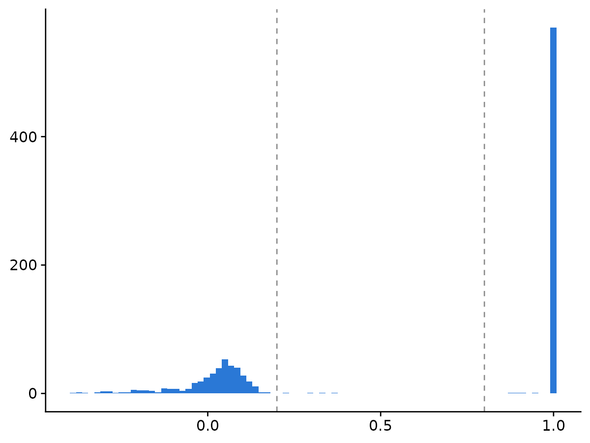
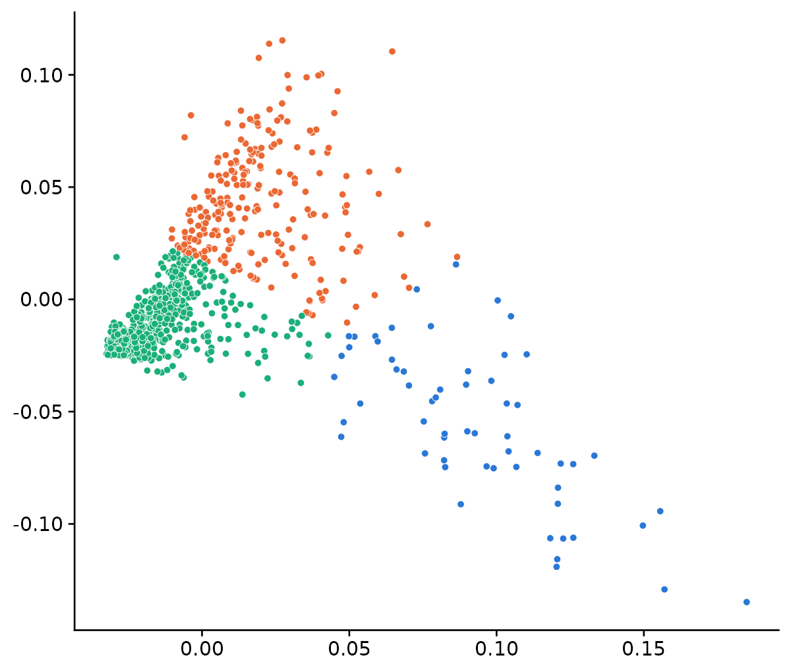
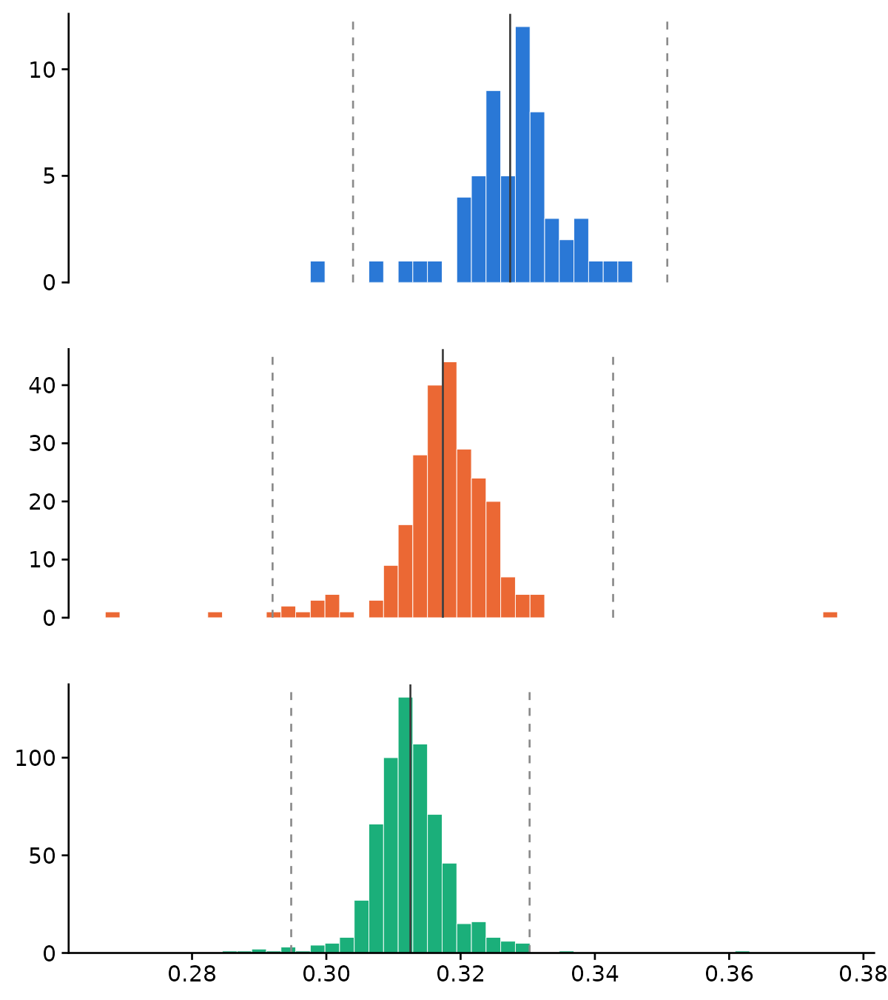
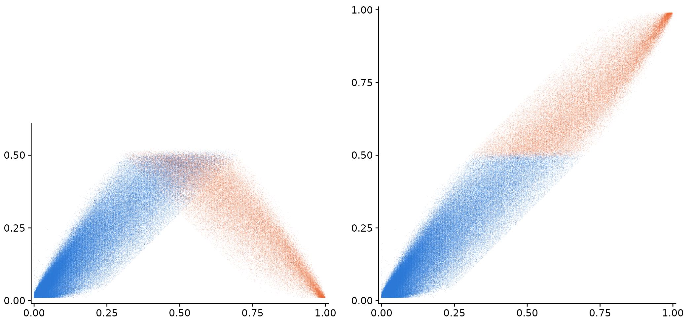

# **From genotype data to polygenic risk scores: a practical end-to-end guide for researchers without bioinformatics training**

**Author: van Zanten, E.S.**


**This GitHub is created alongside our paper on PRS computation for non-bioinformaticians. We go through the pipeline in the order described in the paper, starting with some preparation steps, followed by QC and PRS computation. Note that for generating the figures, we have a separate R script in this repository called figures.R.**  

**Contents** 

**Quality Control**  
**1.1 Variant and sample missingness**    
**1.2 Sex concordance**   
**1.3 Preliminary PCA and heterozygosity**  
**1.4 Relatedness**  
**1.5 Strict variant filtering and differential missingness**   
**1.6 Hardy-Weinberg**  
**1.7 MAF**  
**1.8 Variant Harmonization**  
**1.9 Principal Component Analysis**  

**Imputation**  
  

### Preparation 

1. **Software, data and programming languages**  
   Make sure you have the software needed for this pipeline downloaded, see [insert singularity container and point to table]. The coding itself is done in bash, and we make the figures in R [version]. For several of the QC and PRS steps, we need to download genetic data of a reference panel. To choose the right reference panel, we refer to our paper section 4.1.

2. **Input data**  
   This pipeline is built for SNP array data, although some of the steps are also relevant for whole exome sequencing (WES) and whole genome sequencing (WGS). For full WES and WGS pipelines, we recommend using [insert good QC papers]. In our case, we use SNP array data in a variant call format (VCF) file. Our data is derived from a stroke GWAS in 986 Brazilian individuals (513 cases, 473 controls).

3. **Configuration**  
   In many scripts, values are often set multiple times throughout the script, and it is often easier and cleaner to assign these values at the beginning of the script so that if you change the values, you only have to do that once at the beginning of the script. Throughout this pipeline, we assign multiple variables to values:  
   *  For reproducibility, we assign a seed. This means that in steps where randomization is applied, we will get the same results every time we run the script.  
   *  When working on computing clusters, it is advisable to set the number of CPU cores that PLINK may use, since if you do not do this, PLINK will attempt to use all available cores on a node, which may exceed your allocated resources. As a default, we will use 4 threads.  
   *  We also specify the output path that will be used to put all the results in, and the input VCF and metadata (for us, the phenotype textfile that states whether each individual is a case or a control, and what their age and sex is)  

```
SEED=1
THREADS=4
OUT=/path_to_output/
VCF=/path_to_vcf/genotypes.vcf.gz
PHENO=/path_to_metadata/phenotypes.txt
```


### Inspecting your data  

Let's start by inspecting our VCF file and the phenotype data, just to get an idea of what each file looks like. Since we specified the paths to those files above, we just have to reference to them in this step.  

1. First inspect the phenotype data. We do not want to print the entire file, just the first two lines of the beginning of the file is enough (head -n 2 does this)   
```
cat "$PHENO" | head -n 2
```  
|Sample ID|FID|IID|Status|Sex|Age
|---------|---|---|------|---|---|
|00000301 |00000301_2-375928.CEL|00000301_2-375928.CEL|Case|FEMALE|60|
|00000305 |00000305_2-362470.CEL|00000305_2-362470.CEL|Case|MALE  |53|


In our case, the FID (family ID) and IID (individual ID) are the same, since we do not have families in our cohort to our knowledge (spoiler: later in the pipeline, we will find out we do have relatives). The first two individuals are both cases, one is male (aged 53) and one is female (aged 60).  

2. Let's also inspect what the VCF looks like, and what types of variants our VCF contains.  
A VCF is often gzipped (compressed; ending in .gz) since it is very large, and it has a long header that contains specifics on the genotypes (e.g. build, how the VCF was derived). Since we just want to inspect the data itself, we therefore have to use a different command than for the phenotyping file, and BCFtools is designed to do this.  

```
bcftools view -H "$VCF" | head -n 1
```
This skips the header (-H), and shows the data for the first variant. For readability, we just paste the genotypes of the first 4 individuals:
|CHROM|POS|ID|REF|ALT|QUAL|FILTER|INFO|FORMAT|           |
|-----|---|--|---|---|----|------|----|------|-----------|
1     |  86028  | AX-13216142   |  T  |     C    |   .   |    .     |  PR        |      GT  |    0/0     0/0     0/0     0/0 |             

Per column:  
1: chromosome  
86028: position on the chromosome  
AX-13216142: variant ID (in our case, the Axiom assay probe name, not an rsID)  
T: reference allele  
C: alternative allele  
.: quality score (empty, since SNP arrays don't give one)  
.: filter status (empty, no filters applied)  
PR: extra information: here a flag that the reference allele is provisional, we will check this later on in the pipeline  
GT: format of the sample columns: they hold genotypes (GT)  

Genotypes are then counted as follows:  
0/0: two reference alleles (T/T)  
0/1: one reference, one alternative allele (T/C)  
1/1: two alternative alleles (C/C)  
./.: missing, the array failed to call it  

Now we check what kinds of variants, and how many, we have.  
```
bcftools stats "$VCF"
```
This prints a lot of interesting data. For us, the first table is most relevant since it is a summary:  
|SN|[2]id|[3]key|[4]value|  
|--|-----|------|--------|
SN |     0  |     number of samples:   |   986  |
SN |    0    |   number of records:     | 864725 | 
SN  |    0    |   number of no-ALTs:     | 144311 | 
SN   |   0     |number of SNPs: |720414  |
SN     | 0     |  number of MNPs:| 0  |
SN      |0      | number of indels:|       0|  
SN      |0       |number of others: |      0 | 
SN      |0       |number of multiallelic sites:|   0|  
SN      |0       |number of multiallelic SNP sites:  |     0  |

So we have 986 individuals and 864,725 variants, all of them SNPs. The 144,311 "no-ALTs" are SNPs at which everybody in our cohort turned out to have the same genotype, so only one allele was ever seen.

3. We now rewrite the phenotype file into the two columns expected by PLINK. PLINK reads sex as 1 for male and 2 for female, but also accepts the words, so MALE and FEMALE can be passed through unchanged. Case/control status has to become 2 for a case and 1 for a control, which is the part people get backwards most often. Change the column numbers if your file is laid out differently: below, $2 is FID, $3 is IID, $4 is the status and $5 is the sex.
```
awk -F'\t' 'NR==1 {print "#FID\tIID\tSEX\tPHENO"; next}
            {p = ($4=="Case") ? 2 : ($4=="Control") ? 1 : "NA"
             print $2"\t"$3"\t"$5"\t"p}' "$PHENO" > sex_pheno.txt


Now we can use PLINK. Remember to specify the threads and the output directory we put in our configuration! 
plink2 --vcf "$VCF" --double-id \
       --update-sex sex_pheno.txt \
       --pheno sex_pheno.txt --pheno-name PHENO \
       --threads "$THREADS" --make-bed --out "$OUT/first_step"
Here, we first refer to our VCF again, then tell PLINK that the IID and FID are the same. We then update the sex and phenotype status and specify the number of threads PLINK may use. We then generate PLINK files, including a BED, BIM and FAM file (see [insert link] for details on those filetypes). Here, we refer to our output directory for the first time. 

```

What does the result look like?: PLINK tells you what it managed to attach.
For us:
```
1 binary phenotype loaded (513 cases, 473 controls).
--update-sex: 986 samples updated.
```

### 1.1 Missingness
Missingness is the fraction of genotypes that the array failed to call. It can be counted per variant (a probe that works badly in everyone) or per sample (an error in someones DNA that worked badly for every probe). Both variant and sample missingness need a threshold, and the (default) thresholds used in this pipeline are as follows: 
|Step|Threshold|Removes if missing in more than|Keeps call rate of at least|
|------|----|----|---|
|Variant filter (lenient)|0.2|20% of samples|80%|
|Sample filter|0.02|2% of variants|98%|
|Variant filter (strict)|0.02|2% of samples|98%|  

At this stage, we will first perform the lenient variant filtering and the sample filtering. The strict variant filter will be applied later in the pipeline. 
PLINK applies --mind before --geno when both are given in one command, and we want to do the lenient variant filtering before sample filtering (see paper for detailed explanation on this). 

```
plink2 --bfile "$OUT/first_step" --geno 0.2 --threads "$THREADS" --out "$OUT/lenient_var"
In our data, this excludes 1248 variants

plink2 --bfile "$OUT/lenient_var" --mind 0.02 --threads "$THREADS" --out "$OUT/sample_missingn"
In our data, this excludes 8 samples (individuals)

We are now left with 978 samples and 863477 variants. 

``` 


### 1.2 Sex concordance 
We now check that the sex recorded in the phenotype file matches the sex we can read off the genotypes. A mismatch usually means a sample was swapped somewhere between the clinic and the plate, and a swapped sample carries the wrong phenotype, so it has to go. The check works on the X chromosome. Males have one copy and so cannot be heterozygous on it; females have two and are heterozygous at many positions.
PLINK summarises this as an inbreeding coefficient F, which lands near 1 for males and near 0 for females. Below we call F < 0.2 female and F > 0.8 male, and treat anything in between as ambiguous.
Note that this step can only be done in PLINK 1.9 (not PLINK 2, where --check-sex does not exist). 
```
plink --bfile "$OUT/sample_missingn" --check-sex 0.2 0.8 --out "$OUT/sexcheck"

```
What does the result look like? 
One line per sample, with the reported sex (PEDSEX), the sex read from the genotypes (SNPSEX), and STATUS saying OK or
PROBLEM. For us the first line is:
|FID|                     IID |                    PEDSEX|  SNPSEX|  STATUS  | F|
|---|---|---|---|---|---|
00000301_2-375928.CEL |  00000301_2-375928.CEL  | 2   |    1   |    PROBLEM | 0.9987

Plot a histogram of F, with the two cutoffs marked. In a clean cohort you see two tight groups, one at each end, and almost nothing in the middle.  


Remove the samples flagged PROBLEM. For us, this removed 50 samples, leaving 928. That is about 5%, which is more than you would like to see: 32 samples reported male came out female and 14 reported female came out male. A rate this symmetric points at labelling rather than at the DNA, so it is worth asking whoever prepared the plates before you accept it. We remove them either way, just to be absolutely sure our data is clean for the next steps. 
```
We first use awk to create a textfile with the samples that need to be removed. NR>1 is used to skip the first line (the header), then we filter for those rows where column 5 contains "PROBLEM" ($5=="PROBLEM") and print column 1 (FID) and column 2 (IID), separated by a tab ({print $1"\t"$2})
awk 'NR>1 && $5=="PROBLEM" {print $1"\t"$2}' "$OUT/sexcheck.sexcheck" > "$OUT/to_be_removed_sex.txt"

We then tell plink that it should remove those samples that we just generated the textfile for, from our data
plink2 --bfile "$OUT/sample_missingness" --remove "$OUT/to_be_removed_sex.txt" --threads $THREADS --make-bed --out "$OUT/sex_check_finished"

Since in our data, we removed 50 samples, we end up with 928 individuals. 
```

### 1.3 Preliminary PCA and heterozygosity 
Heterozygosity is the fraction of a person's genotypes that carry two different alleles. Too high suggests the sample is a mixture of two DNAs, and too low suggests inbreeding or a degraded sample. Either way it is a sign of a sample we should not trust. However, the 'normal' amount of heterozygosity differs enormously between ancestry groups, so in an admixed cohort like ours, comparing everybody to the mean heterozygosity rates of the entire cohort would flag whole ancestry groups instead of just bad samples. This is why, for cross-ancestry or admixed cohorts, it is advisable to perform a PCA to split the cohort into broad ancestry clusters, then within each cluster we remove individuals more than 3 standard deviations away from that cluster's mean heterozygosity. For relatively homogeneous cohorts such as European cohorts, you can skip the PCA step and directly compute the heterozygosity rates for the entire cohort. 

We perform a PCA to do a rough separation of our cohort into clusters (see the paper to get a full description of how this step works). PCA needs variants that are roughly independent of one another, so we first prune for linkage disequilibrium. We also drop the long-range LD regions of Price et al. (2008), a short list of places in the genome where correlations stretch so far that they dominate the top components and swamp the ancestry signal we are after. Those coordinates are on build GRCh37, so check the build of your own data before using them. See the file high_ld_b37.txt to get a list of these regions. 

```
In the following command, we use plink to:  
- Prune (drop) one of every correlated variant pairs at r2 > 0.2, using a sliding window the size of 200 variants, and steps of 50 variants. We restrict our pruning to the autosomes and common (MAF > 0.05) variants  
- Remove the regions that we specified in the high_ld_b37.txt file, from the Price et al. (2008) paper.   

plink2 --bfile "$OUT/sex_check_finished" --autosome --maf 0.05 \
       --exclude bed1 high_ld_b37.txt \
       --indep-pairwise 200 50 0.2 --threads $THREADS --out "$OUT/pruned_longrange_ld"

This left us with 109,774 variants out of 863,477, written to pruned_longrange_ld.prune.in.
```

We use only the first two principal components, since we want a coarse split into groups, not an ancestry assignment (we leave that for section 3.9). We use PLINK's randomised PCA algorithm (approx). PLINK recommends it only above 5,000 samples and we have fewer, but it is much faster than the exact algorithm, and the difference between the two is far smaller than the spread of the clusters, so it doesn't matter here. Because this algorithm is randomised, we use the seed set in the configuration step. We then calculate heterozygosity for every sample in one go. Each sample's heterozygosity depends only on its own genotypes, so it does not matter that we calculate it for the whole cohort at once. The clusters are used in the next step, where we compare each sample with the average of its own cluster rather than with the whole cohort.


```
plink2 --bfile "$OUT/sex_check_finished" --extract "$OUT/pruned_longrange_ld.prune.in" \
       --pca 2 approx --seed $SEED --threads $THREADS --out "$OUT/rough_pca"

plink2 --bfile "$OUT/sex_check_finished" --extract "$OUT/pruned_longrange_ld.prune.in" --het --threads $THREADS --out "$OUT/full_cohort_het"

#figures.R does the clustering, draws the PCA and the heterozygosity plots, and writes the list of outliers to het_outliers.txt.

#For us it found clusters of 626, 243 and 59 individuals, and flagged 14 outliers.

plink2 --bfile "$OUT/sex_check_finished" --remove "$OUT/het_outliers.txt" --threads $THREADS --make-bed --out "$OUT/het_finished"

#Leaving 914 samples.
```
  <table>
    <tr>
      <td></td>
      <td></td>
    </tr>
    <tr>
      <td align="center"><em>PC1 and PC2, coloured by cluster</em></td>
      <td align="center"><em>Heterozygosity rate per cluster (dashed lines: ±3SD</em></td>
    </tr>
  </table>

### 1.4 Kinship estimation 
Related individuals break the assumption that every sample in your analysis is an independent observation, which both the PRS evaluation and any association testing rely on. This step also checks whether there are any duplicate samples in our data, which can also bias any future analysis we want to do. We estimate kinship with the KING algorithm, which is robust to the population structure that we just observed in our PCA. KING runs on the same pruned variant list. For each pair of individuals, we get a kinship coefficient, which is the probability that an allele drawn from both persons is inherited from the same ancestor. As mentioned in the paper, we use the following thresholds: 

|Threshold|Relationship|
|---|---|
|<0.04|Unrelated|
|0.04-0.09|Third-degree relatives (first cousins)|
|0.09-0.18|Second-degree (half-siblings, grandparent-grandchild)|
|0.18-0.35|First-degree (parent-child, full siblings, dizygotic twins)|
|>0.35|Duplicate samples or monozygotic twins|

```
plink2 --bfile "$OUT/het_finished" --extract "$OUT/pruned_longrange_ld.prune.in" --make-king-table --threads $THREADS --out "$OUT/kinship"
```
Let's look at the count within each band. We now have 914 samples and a total of 417241 sample pairs to be tested. 

|Threshold|Count|
|---|---|
|<0.04|       417149|
|0.04-0.09|37|
|0.09-0.18|14|
|0.18-0.35|33|
|>0.35|8|

The 8 pairs above 0.35 are four people who were genotyped twice, which is worth knowing about before you find them here. It is also worthwhile to mention that it is important to perform the heterozygosity step before estimating kinship, since if we would run this kinship step without checking heterozygosity first, we would include possible contaminated samples, which looks slightly related to everybody. In our case, this would have resulted in 1531 pairs in the 0.04-0.09 band! 

Let's remove one of each pair with a kinship coefficient > 0.09, corroborating with second degree or closer relatives. The --king-cutoff works out which sample to drop so that the fewest samples are lost. 

```
plink2 --bfile "$OUT/het_finished" --extract "$OUT/pruned_longrange_ld.prune.in" \
       --king-cutoff 0.09 --threads $THREADS --out "$OUT/remove_related_individuals"

plink2 --bfile "$OUT/het_finished" --remove "$OUT/remove_related_individuals.out.id" \
       --threads $THREADS --make-bed --out "$OUT/unrelated_individuals"
```
For us this removed 44 samples, leaving 870. Note that the file PLINK writes has a header line, so it has 45 lines for 44 samples - --remove knows this, but do not be caught out if you count them yourself.


### 1.5 Strict variant filter and differential missingness
  Now that we cleaned up all our samples, we repeat the variant filtering at the threshold we
  actually wanted: a 98% call rate. Doing this only now rather than at the beginning means
  that a variant is not dropped on the basis of samples that have been removed.

  ```bash
  plink2 --bfile "$OUT/unrelated_individuals" --geno 0.02 --threads $THREADS --make-bed --out
  "$OUT/strict_variant_filter"
  ```
  For us this removed 9,026 variants, leaving 854,451.

  At this stage, we also test differential missingness between the cases and controls. Since
  our cases and controls were genotyped on separate plates, variants could fail more often on
  one set of plates, resulting in more missingness in cases than controls or vice versa. This
  difference can show up as a false association later on, which is why for every variant we
  test whether its missingness differs between cases and controls. We do this after the strict
  variant filter so that we test on the final set of samples. Note this can only be done in
  PLINK 1.9.

  PLINK wants to know what samples are cases, so we extract those from the phenotype file.
  We use a command called "grep", which can rapidly search and filter for specific strings in
  our phenotyping file. Adding "-w" makes sure that we extract whole words that exactly match
  what we are looking for (e.g. if we would also have "NonCase" in our file and not use -w,
  then we would also extract that). We use "cut -f2,3" to cut to just the second and third
  fields (columns).

  ```bash
  grep -w Case "$PHENO" | cut -f2,3 > "$OUT/cases.txt"
  plink --bfile "$OUT/strict_variant_filter" --make-pheno "$OUT/cases.txt" '*' --test-missing
  --threads $THREADS --out "$OUT/diff_missingness"
  ```
  We only filter for variants that are significantly different in their missingness between
  cases and controls, so we use awk to filter for variant IDs (column 2) with a p-value
  (column 5) below 1e-5.
  ```bash
  awk 'NR>1 && $5<1e-5 {print $2}' "$OUT/diff_missingness.missing" >
  "$OUT/diff_missingness_remove.txt"
  ```
  Now we can use PLINK2 again to exclude these variants. For us, this only excluded 3
  variants.
  ```bash
  plink2 --bfile "$OUT/strict_variant_filter" --exclude "$OUT/diff_missingness_remove.txt"
  --threads $THREADS --make-bed --out "$OUT/diff_missingness_finished"
  ```

  ### 1.6 Hardy-Weinberg equilibrium
  Hardy-Weinberg equilibrium is the genotype frequency you expect from the allele frequency if
  mating is random. A variant that departs from it sharply is usually a genotyping error, so
  we apply it as a filter in this pipeline. Our cohort is case/control, and it is better to
  just test HWE in controls since a real risk variant carried by a case is expected to depart
  from HWE. We therefore collect the variants that depart from HWE in controls, and then
  remove those variants from the cases as well.

  First, we use our .fam file generated by the last step to make a list of control
  individuals. Here, we use awk again to filter just for controls, which are noted as "1" in
  the 6th column (hence $6==1). We then print the FID and IID of those individuals (hence
  {print $1"\t"$2}), which is needed for PLINK to extract them.

  ```bash
  awk '$6==1 {print $1"\t"$2}' "$OUT/diff_missingness_finished.fam" >
  "$OUT/control_samples.txt"
  ```
  Now we can extract those control individuals and apply the HWE filter on these people. We
  want to keep the variants that do not deviate from HWE, therefore we use --write-snplist.
  ```bash
  plink2 --bfile "$OUT/diff_missingness_finished" --keep "$OUT/control_samples.txt" \
         --hwe 1e-6 --write-snplist --threads $THREADS --out "$OUT/hwe_passed"

  plink2 --bfile "$OUT/diff_missingness_finished" --extract "$OUT/hwe_passed.snplist"
  --threads $THREADS --make-bed --out "$OUT/hwe_completed"
  ```
  For us this removed 409 variants, leaving 854,042.

  ### 1.7 Minor allele frequency
  We now filter out variants with a MAF below 1%, since at our sample size, a rare variant is
  carried by too few people to reliably estimate an effect for, and genotype errors also tend
  to concentrate at rare variants since they are harder to call. This is also where the
  144,311 no-ALT variants we saw at the beginning leave the dataset, since a variant with only
  one allele has a frequency of zero and is uninformative.

  ```bash
  plink2 --bfile "$OUT/hwe_completed" --maf 0.01 --threads $THREADS --make-bed --out
  "$OUT/MAF"
  ```
  For us this removed 403,302 variants, leaving 450,740.

  We are now left with 870 samples (479 cases, 391 controls) and 450,740 variants.

  ### 1.8 Variant harmonization
  Different datasets can describe the same variant in different ways (e.g. on a different
  genome build, on the other DNA strand, or with the REF and ALT alleles swapped). It is
  important to have our dataset in line with the reference panel and with the GWAS we will use
  later for PRS computation, otherwise any effect sizes will be applied to the wrong allele.
  In this step, we will compare every variant in our dataset with the 1000 genomes reference
  panel and fix or remove those that do not agree with 1000 genomes.

  For this step, we set up a configuration again by assigning variables to the files we want
  to use:
  * HRC-1000G-check-bim.pl is a perl script that compares our variants with 1000 genomes by
  reading our .bim and .frq files and then checking whether the alleles match, which strand it
  is on, and which allele is the reference. It does not change our data itself, but outputs
  lists of variants to exclude/flip/update.
  * 1000GP_Phase3_combined.legend.gz is a legend file of 1000 genomes that is used in the perl
  script.
  * human_g1k_v37.fasta.gz is used in the last step to determine whether the cleaned up data
  actually matches the reference genome.

  ```bash
  CHECK_BIM=HRC-1000G-check-bim.pl
  LEGEND=1000GP_Phase3_combined.legend.gz
  FASTA=human_g1k_v37.fasta.gz
  ```

  #### Step 1: Check the genome build

  All files we use are on build GRCh37, and we need to make absolutely sure that our data is
  on that build as well. The easiest way to do this is by looking at chromosome 1, which is
  249,250,621 bases long on GRCh37, but only 248,956,422 on GRCh38. So we look up the highest
  position of any variant on chromosome 1 in our data: if it lies beyond 248,956,422, it
  cannot exist on GRCh38, so our data must be on GRCh37.

  ```bash
  awk '$1==1 && $4>max {max=$4} END {print max}' "$OUT/MAF.bim"
  ```
  This looks at lines where the chromosome is 1 ($1==1) and where the position is larger than
  the largest seen so far ($4>max). If the current position is the largest seen so far,
  remember that position ({max=$4}) and after the last line, print the largest position found
  (END {print max}).
  For us, this prints 249,212,878, so our data is on GRCh37. If your data is on GRCh38, you
  can use LiftOver first (see [put link to liftover]), or change the above files to match
  GRCh38.

  #### Step 2: Calculate the allele frequency of every variant in your data

  The checking tool compares the allele frequencies with those in the 1000 genomes file, and
  it expects the .frq format, which is only produced by PLINK 1.9. It is important to use the
  --keep-allele-order command in here, since PLINK 1.9 by default reports only the frequency
  of the rarer allele for every variant, which does not always correspond to the allele
  reported in the A1 column of the .bim file. Since the tool assumes this does correspond,
  without this command it compares the wrong frequencies for these variants (in our case this
  goes for 1,811 variants).

  ```bash
  plink --bfile "$OUT/MAF" --freq --keep-allele-order --threads "$THREADS" --out
  "$OUT/check_freq"
  ```

  #### Step 3: Run the perl script to compare your variants to 1000 genomes

  The tool reads our .bim and .frq files and the 1000 genomes legend file. Since the tool
  needs to read the entire 1000 genomes legend file (~81 million lines), it is recommended to
  run this step as a batch job rather than on a login node, since this can take very long or
  get killed.
  ```bash
  perl "$CHECK_BIM" -b "$OUT/MAF.bim" -f "$OUT/check_freq.frq" -r "$LEGEND" -g -p AMR
  ```
  Here, we call the perl script to run the analysis on the .bim file we created at the MAF
  step, and specify the .frq file we created in the last step. We point to the reference file
  (-r, the 1000 genomes legend file), and tell the script that we are using 1000 genomes (not
  HRC) as a reference panel by adding -g. We pick the population closest to our cohort, which
  is the admixed American population of 1000 genomes (AMR: people from Mexico, Puerto Rico,
  Colombia and Peru), by adding -p AMR.

  The summary of the result is printed in a .txt file. In our case:
  * A total of 25,335 variants are listed for removal:
      - 18,327 variants are not in 1000 Genomes. 17,057 of these are on chromosomes X, XY, Y
  and MT, which the legend file does not cover, so from here on our data only contains
  chromosomes 1-22. The other 1,270 are on chromosomes 1-22 but are not in 1000 Genomes.
      - 2,799 variants have alleles that do not match 1000 genomes (e.g. A/G in our data, and
  A/C in 1000 Genomes).
      - 2,032 variants have allele frequencies more than 0.2 away from the reference. In our
  case, this can be due to ancestry, but we remove them just to be sure.
      - 1,830 are palindromic SNPs (A/T or C/G) with a MAF above 0.4, in which case we cannot
  tell whether this is a strand flip or real alleles.
      - 347 variants are duplicates of another variant at the same position.
  * None of our variants needed a strand flip or a new position.

  #### Step 4: Apply the generated lists

  We again use PLINK 1.9 for this, to flip strands (if needed).

  Remove the variants listed by the tool:
  ```bash
  plink --bfile "$OUT/MAF" --exclude "$OUT/Exclude-MAF-1000G.txt" --threads "$THREADS"
  --make-bed --out "$OUT/variants_in_reference"
  ```
  Now, correct chromosomes and positions that differ from the reference (we did not have to do
  this for our data):
  ```bash
  plink --bfile "$OUT/variants_in_reference" --update-chr "$OUT/Chromosome-MAF-1000G.txt"
  --threads $THREADS --make-bed --out "$OUT/chr_updated"

  plink --bfile "$OUT/chr_updated" --update-map "$OUT/Position-MAF-1000G.txt" --threads
  "$THREADS" --make-bed --out "$OUT/pos_updated"
  ```
  Also flip variants that were reported to be on the other strand (we did not have to do this
  for our data):
  ```bash
  plink --bfile "$OUT/pos_updated" --flip "$OUT/Strand-Flip-MAF-1000G.txt" --threads $THREADS
  --make-bed --out "$OUT/strand_flipped_correct"
  ```
  Now we set the reference allele to the one reported in 1000 genomes. In PLINK, --a2-allele
  puts the reference allele in the A2 column, which is where PLINK keeps the reference allele,
  and then --keep-allele-order is used to stop PLINK from swapping these alleles back when it
  writes the files.
  ```bash
  plink --bfile "$OUT/strand_flipped_correct" --a2-allele "$OUT/Force-Allele1-MAF-1000G.txt"
  --keep-allele-order --threads $THREADS --make-bed --out "$OUT/harmonization_finished"
  ```
  For us, this changed the reference allele for 76,872 variants, which PLINK had guessed the
  wrong way around when it created the files (remember some of our variants had the PR,
  "provisional reference allele" flag in the VCF).

  #### Step 5: Check the result against the reference genome

  As a double-check, we now check the result of this harmonization against the reference
  genome. Using the --ref-from-fa command looks up the base at each position in the GRCh37
  FASTA file and compares it with our reference allele. If we did the harmonization correctly,
  nothing should need changing.

  ```bash
  plink2 --bfile "$OUT/harmonization_finished" --fa "$FASTA" --ref-from-fa --threads $THREADS
  --make-just-bim --out "$OUT/harmonization_check"
  ```

  Output for us:
  ```
  --ref-from-fa: 0 variants changed, 425405 validated.
  ```
  Hooray!


Last but not least for this step, it is nice to show the before and after of the harmonization. Before harmonization, the orange variants lie on the anti-diagonal because their REF and ALT alleles are swapped, and after harmonization all variants lie on the diagonal. The y-axis of the first plot runs to 0.6 because our ALT allele is ALMOST always the rarer one, and a few variants end up just above 0.5. For the orange variants, the variant labelled as the ALT in our data is the REF in the 1000 genomes data, so after harmonization these are corrected and the frequencies move above 0.5. 
  <table>
    <tr>
      <td colspan="2"></td>
    </tr>
    <tr>
      <td align="center" width="50%"><em>Before harmonization</em></td>
      <td align="center" width="50%"><em>After harmonization</em></td>
    </tr>
  </table>


