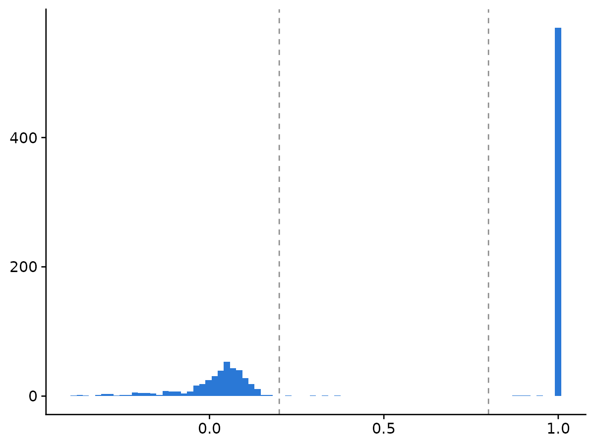
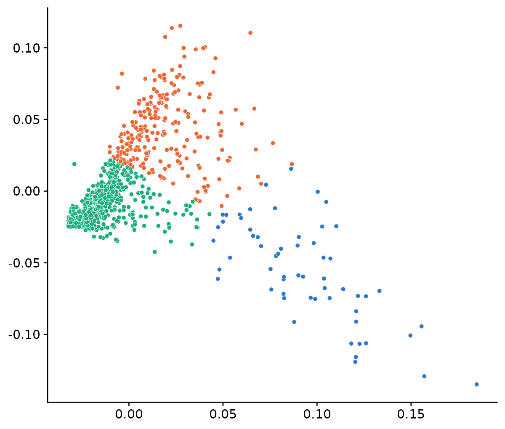
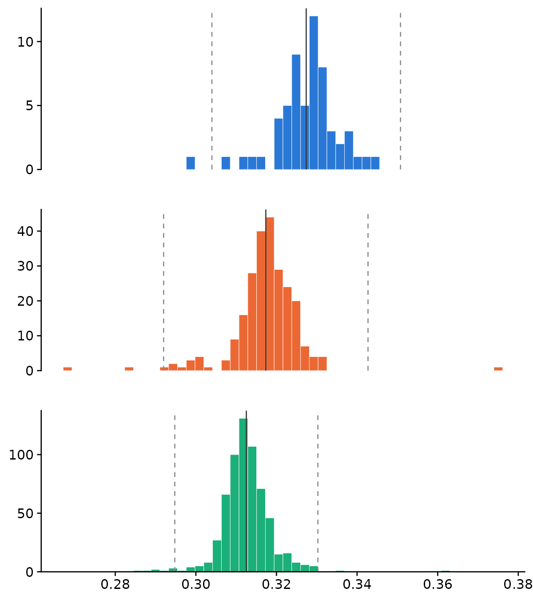
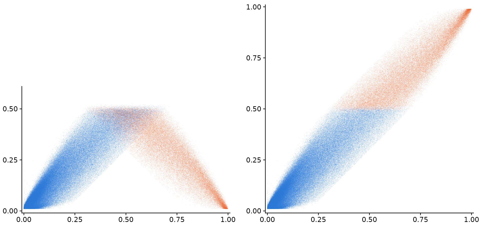
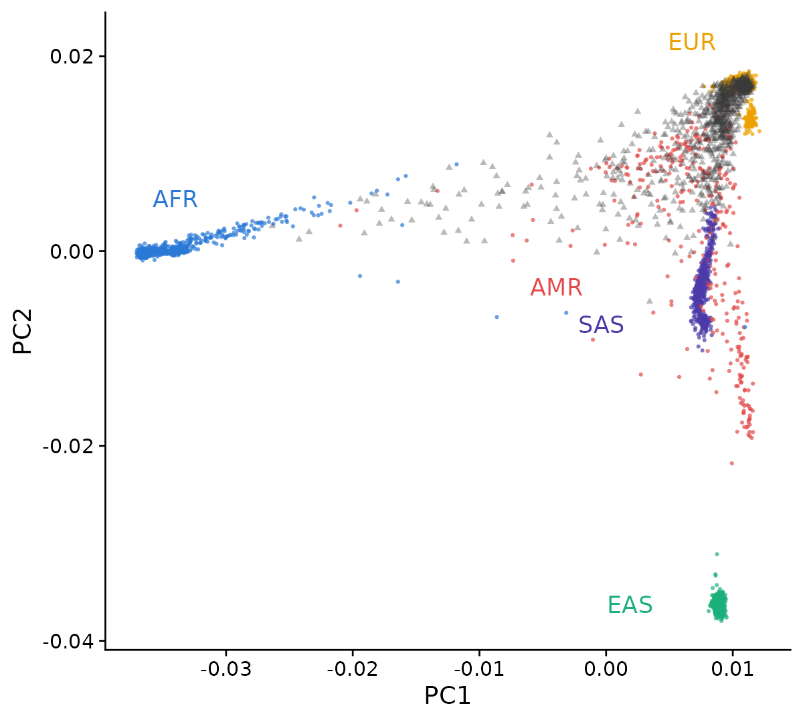
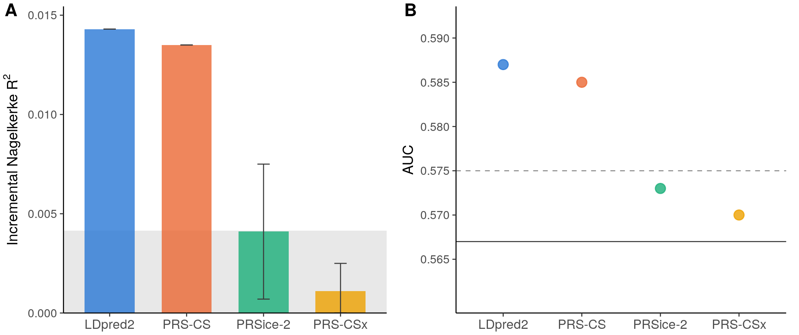

  # **From genotype data to polygenic risk scores: a practical end-to-end guide for researchers without bioinformatics training**

  **Author: van Zanten, E.S.**


  **This GitHub is created alongside our paper on PRS computation for non-bioinformaticians. We go through the pipeline in the order described in the paper, starting with some preparation steps, followed by
  QC and PRS computation. The pipeline needs two short R scripts, pca_clusters.R and match_sumstats.R, both of which are in this repository.**

  ## Contents

  ### Quality control  
  **1.1 Variant and sample missingness**  
  **1.2 Sex concordance**  
  **1.3 Preliminary PCA and heterozygosity**  
  **1.4 Kinship estimation**  
  **1.5 Strict variant filtering and differential missingness**  
  **1.6 Hardy-Weinberg**  
  **1.7 MAF**  
  **1.8 Variant harmonization**  
  **1.9 Principal component analysis**  

  ### Phasing and imputation  

  ### PRS calculation  
  **3.1 Preparing the summary statistics**  
  **3.2 Target file formats**  
  **3.3 PRSice-2**  
  **3.4 LDpred2**  
  **3.5 PRS-CS**  
  **3.6 PRS-CSx**  
  **3.7 Validation of the PRS**  


  ### Preparation

  1. **Software, data and programming languages**
     Every tool this pipeline uses is in one Apptainer (Singularity) image, at one set of pinned versions, so that a rerun a year from now means something. The recipe is `container/pipeline.def` and the
  version table is in [SOFTWARE.md](SOFTWARE.md); the two are kept in step with each other. Pull the prebuilt image:

     ```bash
     apptainer pull genotype-qc.sif oras://ghcr.io/evanzanten/prs-pipeline:latest
     ```
  The key versions, all in the image: PLINK 1.90b7.11 (2023-12-11), PLINK 2.00a3.7 (2022-10-24), bcftools/HTSlib 1.18, Beagle 5.5 (27Feb25.75f), PRSice-2 2.3.5, and R 4.3.2 with data.table 1.14.10,
  ggplot2 3.4.4 and scales 1.3.0 from a dated CRAN snapshot. The coding itself is done in bash, and we make the figures in R.

The container holds the tools but not the data (the reference panels are around 20 GB each, they are public, and they change on their own schedule). To choose the right reference panel, we refer to our paper section 4.1.

  2. **Input data**
     This pipeline is built for SNP array data, although some of the steps are also relevant for whole exome sequencing (WES) and whole genome sequencing (WGS). For full WES and WGS pipelines, we recommend
  the Nature Protocols tutorial by Sealock et al., *Tutorial: guidelines for quality filtering of whole-exome and whole-genome sequencing data for population-scale association analyses*, Nature Protocols
  20:2372-2382 (2025), which covers sample and variant filtering and compares the commonly used tools. In our case, we use SNP array data in a variant call format (VCF) file. Our data is derived from a
  stroke GWAS in 986 Brazilian individuals (513 cases, 473 controls).

  3. **Configuration**
     In many scripts, values are often set multiple times throughout the script, and it is often easier and cleaner to assign these values at the beginning of the script so that if you change the values,
  you only have to do that once at the beginning of the script. Throughout this pipeline, we assign multiple variables to values:
     *  For reproducibility, we assign a seed. This means that in steps where randomization is applied, we will get the same results every time we run the script.
     *  When working on computing clusters, it is advisable to set the number of CPU cores that PLINK may use, since if you do not do this, PLINK will attempt to use all available cores on a node, which may
  exceed your allocated resources. As a default, we will use 4 threads.
     *  We also specify the output path that will be used to put all the results in, and the input VCF and metadata (for us, the phenotype textfile that states whether each individual is a case or a
  control, and what their age and sex is)

  ```bash
  SEED=1
  THREADS=4
  OUT=/path_to_output
  VCF=/path_to_vcf/genotypes.vcf.gz
  PHENO=/path_to_metadata/phenotypes.txt
  ```


  ### Inspecting your data

  Let's start by inspecting our VCF file and the phenotype data, just to get an idea of what each file looks like. Since we specified the paths to those files above, we just have to reference to them in
  this step.

  1. First inspect the phenotype data. We do not want to print the entire file, just the first two lines of the beginning of the file is enough (head -n 2 does this)
  ```bash
  cat "$PHENO" | head -n 2
  ```
  |Sample ID|FID|IID|Status|Sex|Age
  |---------|---|---|------|---|---|
  |00000301 |00000301_2-375928.CEL|00000301_2-375928.CEL|Case|FEMALE|60|
  |00000305 |00000305_2-362470.CEL|00000305_2-362470.CEL|Case|MALE  |53|


  In our case, the FID (family ID) and IID (individual ID) are the same, since we do not have families in our cohort to our knowledge (spoiler: later in the pipeline, we will find out we do have relatives).
  The first two individuals are both cases, one is male (aged 53) and one is female (aged 60).

  If your phenotype file was made on Windows, strip the carriage returns before you use it (`tr -d '\r' < "$PHENO" > pheno_clean.txt`). They stick to the last column and turn it into text, which tools then
  read as missing without complaining.

  2. Let's also inspect what the VCF looks like, and what types of variants our VCF contains.
  A VCF is often gzipped (compressed; ending in .gz) since it is very large, and it has a long header that contains specifics on the genotypes (e.g. build, how the VCF was derived). Since we just want to
  inspect the data itself, we therefore have to use a different command than for the phenotyping file, and BCFtools is designed to do this.

  ```bash
  bcftools view -H "$VCF" | head -n 1
  ```
  This skips the header (-H), and shows the data for the first variant. For readability, we just paste the genotypes of the first 4 individuals:
  |CHROM|POS|ID|REF|ALT|QUAL|FILTER|INFO|FORMAT|           |
  |-----|---|--|---|---|----|------|----|------|-----------|
  1     |  86028  | AX-13216142   |  T  |     C    |   .   |    .     |  PR        |      GT  |    0/0     0/0     0/0     0/0 |

  Per column:
  1: chromosome
  86028: position on the chromosome
  AX-13216142: variant ID (in our case, the Axiom assay probe name, not an rsID)
  T: reference allele
  C: alternative allele
  .: quality score (empty, since SNP arrays don't give one)
  .: filter status (empty, no filters applied)
  PR: extra information: here a flag that the reference allele is provisional, we will check this later on in the pipeline
  GT: format of the sample columns: they hold genotypes (GT)

  Genotypes are then counted as follows:
  0/0: two reference alleles (T/T)
  0/1: one reference, one alternative allele (T/C)
  1/1: two alternative alleles (C/C)
  ./.: missing, the array failed to call it

  Now we check what kinds of variants, and how many, we have.
  ```bash
  bcftools stats "$VCF"
  ```
  This prints a lot of interesting data. For us, the first table is most relevant since it is a summary:

  |SN|[2]id|[3]key|[4]value|
  |--|-----|------|--------|
  SN |     0  |     number of samples:   |   986  |
  SN |    0    |   number of records:     | 864725 |
  SN  |    0    |   number of no-ALTs:     | 144311 |
  SN   |   0     |number of SNPs: |720414  |
  SN     | 0     |  number of MNPs:| 0  |
  SN      |0      | number of indels:|       0|
  SN      |0       |number of others: |      0 |
  SN      |0       |number of multiallelic sites:|   0|
  SN      |0       |number of multiallelic SNP sites:  |     0  |

  So we have 986 individuals and 864,725 variants, all of them SNPs. The 144,311 "no-ALTs" are SNPs at which everybody in our cohort turned out to have the same genotype, so only one allele was ever seen.

  3. We now rewrite the phenotype file into the columns expected by PLINK. PLINK reads sex as 1 for male and 2 for female, but also accepts the words, so MALE and FEMALE can be passed through unchanged.
  Case/control status has to become 2 for a case and 1 for a control, which is the part people get backwards most often. Change the column numbers if your file is laid out differently: below, $2 is FID, $3
  is IID, $4 is the status and $5 is the sex.

  ```bash
  awk -F'\t' 'NR==1 {print "#FID\tIID\tSEX\tPHENO"; next}
              {p = ($4=="Case") ? 2 : ($4=="Control") ? 1 : "NA"
               print $2"\t"$3"\t"$5"\t"p}' "$PHENO" > "$OUT/sex_pheno.txt"
  ```

  Now we can use PLINK. Remember to specify the threads and the output directory we put in our configuration! Here, we first refer to our VCF again, then tell PLINK that the IID and FID are the same. We
  then update the sex and phenotype status and specify the number of threads PLINK may use. We then generate PLINK files, including a BED, BIM and FAM file (see the [PLINK file format
  reference](https://www.cog-genomics.org/plink/1.9/formats) for details on those filetypes; note that a PLINK .bed has nothing to do with the UCSC Genome Browser's BED format).

  ```bash
  plink2 --vcf "$VCF" --double-id \
         --update-sex "$OUT/sex_pheno.txt" \
         --pheno "$OUT/sex_pheno.txt" --pheno-name PHENO \
         --threads "$THREADS" --make-bed --out "$OUT/first_step"
  ```

  What does the result look like?: PLINK tells you what it managed to attach. For us:
  ```
  1 binary phenotype loaded (513 cases, 473 controls).
  --update-sex: 986 samples updated.
  ```

  ## Quality control

  ### 1.1 Missingness
  Missingness is the fraction of genotypes that the array failed to call. It can be counted per variant (a probe that works badly in everyone) or per sample (an error in someones DNA that worked badly for
  every probe). Both variant and sample missingness need a threshold, and the (default) thresholds used in this pipeline are as follows:

  |Step|Threshold|Removes if missing in more than|Keeps call rate of at least|
  |------|----|----|---|
  |Variant filter (lenient)|0.2|20% of samples|80%|
  |Sample filter|0.02|2% of variants|98%|
  |Variant filter (strict)|0.02|2% of samples|98%|

  At this stage, we will first perform the lenient variant filtering and the sample filtering. The strict variant filter will be applied later in the pipeline.
  PLINK applies --mind before --geno when both are given in one command, and we want to do the lenient variant filtering before sample filtering (see paper for detailed explanation on this).

  ```bash
  plink2 --bfile "$OUT/first_step" --geno 0.2 --threads "$THREADS" --make-bed --out "$OUT/lenient_var"

  plink2 --bfile "$OUT/lenient_var" --mind 0.02 --threads "$THREADS" --make-bed --out "$OUT/sample_missingn"
  ```
  Note the --make-bed in both commands: without it PLINK only writes a log and the next step has no file to read.

  In our data, the first command excludes 1,248 variants and the second excludes 8 samples, so we are left with 978 samples and 863,477 variants.

  These are conventional thresholds rather than rules, so it is worth looking at the distributions instead of taking them on trust. --missing writes two tables: one missingness rate per variant (.vmiss) and one per sample (.smiss). What you are looking for is a distinct group of samples sitting just inside the cutoff, since that usually means a technical problem such as a failed plate rather than a few individually poor samples, and in that case a stricter threshold is warranted.

  ```bash
  plink2 --bfile "$OUT/first_step" --missing --threads "$THREADS" --out "$OUT/missingness"
  ```


  ### 1.2 Sex concordance
  We now check that the sex recorded in the phenotype file matches the sex we can read off the genotypes. A mismatch usually means a sample was swapped somewhere between the clinic and the plate, and a
  swapped sample carries the wrong phenotype, so it has to go. The check works on the X chromosome. Males have one copy and so cannot be heterozygous on it; females have two and are heterozygous at many
  positions.
  PLINK summarises this as an inbreeding coefficient F, which lands near 1 for males and near 0 for females. Below we call F < 0.2 female and F > 0.8 male, and treat anything in between as ambiguous.
  Note that this step can only be done in PLINK 1.9 (not PLINK 2, where --check-sex does not exist).
  ```bash
  plink --bfile "$OUT/sample_missingn" --check-sex 0.2 0.8 --out "$OUT/sexcheck"
  ```
  What does the result look like?
  One line per sample, with the reported sex (PEDSEX), the sex read from the genotypes (SNPSEX), and STATUS saying OK or PROBLEM. For us the first line is:

  |FID|                     IID |                    PEDSEX|  SNPSEX|  STATUS  | F|
  |---|---|---|---|---|---|
  00000301_2-375928.CEL |  00000301_2-375928.CEL  | 2   |    1   |    PROBLEM | 0.9987

  Plot a histogram of F, with the two cutoffs marked. In a clean cohort you see two tight groups, one at each end, and almost nothing in the middle.
  

  Remove the samples flagged PROBLEM. For us, this removed 50 samples, leaving 928. That is about 5%, which is more than you would like to see: 32 samples reported male came out female and 18 reported
  female came out male. A rate this symmetric points at labelling rather than at the DNA, so it is worth asking whoever prepared the plates before you accept it. We remove them either way, just to be
  absolutely sure our data is clean for the next steps. For your cohort, it is worth finding out what the source of the mismatches are (could be difference between reported gender and chromosomal sex, or sex chromosome variations such as Turner or Klinefelter syndrome). 

  We first use awk to create a textfile with the samples that need to be removed. NR>1 is used to skip the first line (the header), then we filter for those rows where column 5 contains "PROBLEM"
  ($5=="PROBLEM") and print column 1 (FID) and column 2 (IID), separated by a tab ({print $1"\t"$2}).

  ```bash
  awk 'NR>1 && $5=="PROBLEM" {print $1"\t"$2}' "$OUT/sexcheck.sexcheck" > "$OUT/to_be_removed_sex.txt"

  plink2 --bfile "$OUT/sample_missingn" --remove "$OUT/to_be_removed_sex.txt" --threads $THREADS --make-bed --out "$OUT/sex_check_finished"
  ```
  Since in our data, we removed 50 samples, we end up with 928 individuals.

  ### 1.3 Preliminary PCA and heterozygosity
  Heterozygosity is the fraction of a person's genotypes that carry two different alleles. Too high suggests the sample is a mixture of two DNAs, and too low suggests inbreeding or a degraded sample. Either
  way it is a sign of a sample we should not trust. However, the 'normal' amount of heterozygosity differs enormously between ancestry groups, so in an admixed cohort like ours, comparing everybody to the
  mean heterozygosity rates of the entire cohort would flag whole ancestry groups instead of just bad samples. This is why, for cross-ancestry or admixed cohorts, it is advisable to perform a PCA to split
  the cohort into broad ancestry clusters, then within each cluster we remove individuals more than 3 standard deviations away from that cluster's mean heterozygosity. For relatively homogeneous cohorts
  such as European cohorts, you can skip the PCA step and directly compute the heterozygosity rates for the entire cohort.

  We perform a PCA to do a rough separation of our cohort into clusters (see the paper to get a full description of how this step works). PCA needs variants that are roughly independent of one another, so
  we first prune for linkage disequilibrium. We also drop the long-range LD regions of Price et al. (2008), a short list of places in the genome where correlations stretch so far that they dominate the top
  components and swamp the ancestry signal we are after. Those coordinates are on build GRCh37, so check the build of your own data before using them. See the file high_ld_b37.txt to get a list of these
  regions.

  In the following command, we use PLINK to:
  - Prune (drop) one of every correlated variant pairs at r2 > 0.2, using a sliding window the size of 200 variants, and steps of 50 variants. We restrict our pruning to the autosomes and common (MAF >
  0.05) variants
  - Remove the regions that we specified in the high_ld_b37.txt file, from the Price et al. (2008) paper.

  ```bash
  plink2 --bfile "$OUT/sex_check_finished" --autosome --maf 0.05 \
         --exclude bed1 high_ld_b37.txt \
         --indep-pairwise 200 50 0.2 --threads $THREADS --out "$OUT/pruned_longrange_ld"
  ```
  This left us with 109,774 variants out of 863,477, written to pruned_longrange_ld.prune.in.

  We use only the first two principal components, since we want a coarse split into groups, not an ancestry assignment (we leave that for section 1.9). We use PLINK's randomised PCA algorithm (approx).
  PLINK recommends it only above 5,000 samples and we have fewer, but it is much faster than the exact algorithm, and the difference between the two is far smaller than the spread of the clusters, so it
  doesn't matter here. Because this algorithm is randomised, we use the seed set in the configuration step. We then calculate heterozygosity for every sample in one go. Each sample's heterozygosity depends
  only on its own genotypes, so it does not matter that we calculate it for the whole cohort at once. The clusters are used in the next step, where we compare each sample with the average of its own cluster
  rather than with the whole cohort.

  ```bash
  plink2 --bfile "$OUT/sex_check_finished" --extract "$OUT/pruned_longrange_ld.prune.in" \
         --pca 2 approx --seed $SEED --threads $THREADS --out "$OUT/rough_pca"

  plink2 --bfile "$OUT/sex_check_finished" --extract "$OUT/pruned_longrange_ld.prune.in" --het --threads $THREADS --out "$OUT/full_cohort_het"

  # pca_clusters.R clusters the cohort on PC1 and PC2, then flags the individuals whose
  # heterozygosity is more than 3 SD from the mean of their own cluster. It writes two files:
  # het_outliers.txt, which the next command removes, and clusters.txt, which step 1.6 reads.
  # For us it found clusters of 626, 243 and 59 individuals, and flagged 14 outliers.
  Rscript pca_clusters.R clusters

  plink2 --bfile "$OUT/sex_check_finished" --remove "$OUT/het_outliers.txt" --threads $THREADS --make-bed --out "$OUT/het_finished"
  ```
  Leaving 914 samples.

  <table>
    <tr>
      <td></td>
      <td></td>
    </tr>
    <tr>
      <td align="center"><em>PC1 and PC2, coloured by cluster</em></td>
      <td align="center"><em>Heterozygosity rate per cluster (dashed lines: 3SD)</em></td>
    </tr>
  </table>

  ### 1.4 Kinship estimation
  Related individuals break the assumption that every sample in your analysis is an independent observation, which both the PRS evaluation and any association testing rely on. This step also checks whether
  there are any duplicate samples in our data, which can also bias any future analysis we want to do. We estimate kinship with the KING algorithm, which is robust to the population structure that we just
  observed in our PCA. KING runs on the same pruned variant list. For each pair of individuals, we get a kinship coefficient, which is the probability that an allele drawn from both persons is inherited
  from the same ancestor. As mentioned in the paper, we use the following thresholds, based on the paper by [Manichaikul et al](https://www.cog-genomics.org/static/pdf/Manichaikuletal2010.pdf):

  |Threshold|Relationship|
  |---|---|
  |<0.0442|Unrelated|
  |0.0442-0.0884|Third-degree relatives (first cousins)|
  |0.0884-0.177|Second-degree (half-siblings, grandparent-grandchild)|
  |0.177-0.354|First-degree (parent-child, full siblings, dizygotic twins)|
  |>0.354|Duplicate samples or monozygotic twins|

  ```bash
  plink2 --bfile "$OUT/het_finished" --extract "$OUT/pruned_longrange_ld.prune.in" --make-king-table --threads $THREADS --out "$OUT/kinship"
  ```
  Let's look at the count within each band. We now have 914 samples and a total of 417,241 sample pairs to be tested.

  |Threshold|Count|
  |---|---|
  |<0.0442|       417160|
  |0.0442-0.0884|26|
  |0.0884-0.177|14|
  |0.177-0.354|33|
  |>0.354|8|

  The 8 pairs above 0.35 are worth looking at individually rather than counting. Four of them are pairs that share a sample ID, so they are the same person genotyped twice. The other four are pairs with
  different sample IDs, and two of those are discordant for case/control status, meaning the same DNA appears in our data once as a case and once as a control. That is a labelling problem rather than a
  genetics one, and it is worth resolving with whoever assembled the cohort. Either way both members of such a pair cannot stay.
  It is also worthwhile to mention that it is important to perform the heterozygosity step before estimating kinship, since if we would run this kinship step without checking heterozygosity first, we would
  include possible contaminated samples, which looks slightly related to everybody. In our case, this would have resulted in 1,531 pairs in the 0.04-0.09 band!

  Let's remove one of each pair with a kinship coefficient > 0.09, corroborating with second degree or closer relatives. The --king-cutoff works out which sample to drop so that the fewest samples are lost.

  ```bash
  plink2 --bfile "$OUT/het_finished" --extract "$OUT/pruned_longrange_ld.prune.in" \
         --king-cutoff 0.0884 --threads $THREADS --out "$OUT/remove_related_individuals"

  plink2 --bfile "$OUT/het_finished" --remove "$OUT/remove_related_individuals.out.id" \
         --threads $THREADS --make-bed --out "$OUT/unrelated_individuals"
  ```
  For us this removed 44 samples, leaving 870. Note that the file PLINK writes has a header line, so it has 45 lines for 44 samples - --remove knows this, but do not be caught out if you count them
  yourself.


  ### 1.5 Strict variant filter and differential missingness
  Now that we cleaned up all our samples, we repeat the variant filtering at the threshold we actually wanted: a 98% call rate. Doing this only now rather than at the beginning means that a variant is not
  dropped on the basis of samples that have been removed.

  ```bash
  plink2 --bfile "$OUT/unrelated_individuals" --geno 0.02 --threads $THREADS --make-bed --out "$OUT/strict_variant_filter"
  ```
  For us this removed 9,026 variants, leaving 854,451.

  At this stage, we also test differential missingness between the cases and controls. Since our cases and controls were genotyped on separate plates, variants could fail more often on one set of plates,
  resulting in more missingness in cases than controls or vice versa. This difference can show up as a false association later on, which is why for every variant we test whether its missingness differs
  between cases and controls. We do this after the strict variant filter so that we test on the final set of samples. Note this can only be done in PLINK 1.9.

  PLINK wants to know what samples are cases, so we extract those from the phenotype file. We use a command called "grep", which can rapidly search and filter for specific strings in our phenotyping file.
  Adding "-w" makes sure that we extract whole words that exactly match what we are looking for (e.g. if we would also have "NonCase" in our file and not use -w, then we would also extract that). We use
  "cut -f2,3" to cut to just the second and third fields (columns).

  ```bash
  grep -w Case "$PHENO" | cut -f2,3 > "$OUT/cases.txt"
  plink --bfile "$OUT/strict_variant_filter" --make-pheno "$OUT/cases.txt" '*' --test-missing \
        --threads $THREADS --out "$OUT/diff_missingness"
  ```
  We only filter for variants that are significantly different in their missingness between cases and controls, so we use awk to filter for variant IDs (column 2) with a p-value (column 5) below 1e-5.
  ```bash
  awk 'NR>1 && $5<1e-5 {print $2}' "$OUT/diff_missingness.missing" > "$OUT/diff_missingness_remove.txt"
  ```
  Now we can use PLINK2 again to exclude these variants. For us, this only excluded 3 variants, leaving 854,448.

  One note on our own numbers: we added this test after the run that produced everything below, so the variant counts from 1.6 onwards are from a chain in which those 3 variants were still present. Removing
  3 of 854,000 changes nothing that matters, but it is why 1.6 starts from 854,451 rather than 854,448.
  ```bash
  plink2 --bfile "$OUT/strict_variant_filter" --exclude "$OUT/diff_missingness_remove.txt" \
         --threads $THREADS --make-bed --out "$OUT/diff_missingness_finished"
  ```

  ### 1.6 Hardy-Weinberg equilibrium
  Hardy-Weinberg equilibrium is the genotype frequency you expect from the allele frequency if mating is random. A variant that departs from it sharply is usually a genotyping error, so we apply it as a
  filter in this pipeline. Our cohort is case/control, and it is better to just test HWE in controls since a real risk variant carried by a case is expected to depart from HWE. We therefore collect the
  variants that depart from HWE in controls, and then remove those variants from the cases as well.

  There is a second complication. HWE assumes one randomly mating population, and our cohort is admixed, so the allele frequency differences between ancestries make variants look like they are out of HWE
  even when the genotyping is perfectly fine. We therefore test each ancestry cluster separately, using the clusters that pca_clusters.R wrote in step 1.3, and keep only the variants that pass in every
  cluster.

  First we make a list of the controls. In a .fam file the sixth column holds the phenotype, where 1 is a control and 2 a case, so we keep the rows where that column is 1 and print the FID and IID that
  PLINK needs.

  ```bash
  awk '$6==1 {print $1"\t"$2}' "$OUT/diff_missingness_finished.fam" > "$OUT/control_samples.txt"
  ```

  Next we split those controls by cluster and run the test inside each one. The awk command reads two files in turn. From the first, the control list, it remembers every IID. From the second, clusters.txt,
  it keeps the rows whose cluster number (the third column) is the cluster we are on and whose IID it saw in the control list. FNR>1 skips the header line of clusters.txt.

  ```bash
  for k in 1 2 3; do
    awk -v k=$k 'NR==FNR {ctl[$2]=1; next} FNR>1 && $3==k && ctl[$2] {print $1"\t"$2}' \
        "$OUT/control_samples.txt" "$OUT/clusters.txt" > "$OUT/controls_cluster${k}.txt"

    plink2 --bfile "$OUT/diff_missingness_finished" --keep "$OUT/controls_cluster${k}.txt" \
           --hwe 1e-6 --write-snplist --threads $THREADS --out "$OUT/hwe_cluster${k}"
  done
  ```

  Each run writes out the variants that passed in that cluster. A variant has to pass in all three, so we pool the three lists, count how often each variant appears, and keep the ones that appear three
  times.

  ```bash
  sort "$OUT"/hwe_cluster[123].snplist | uniq -c | awk '$1==3 {print $2}' > "$OUT/hwe_passed.snplist"

  plink2 --bfile "$OUT/diff_missingness_finished" --extract "$OUT/hwe_passed.snplist" \
         --threads $THREADS --make-bed --out "$OUT/hwe_completed"
  ```

  For us this removed 296 of the 854,451 variants, leaving 854,155. The numbers per cluster show why it is worth doing this way:

  |                                            | Controls | Failing HWE at p < 1e-6 |
  |--------------------------------------------|----------|-------------------------|
  | Cluster 1                                  | 19       | 53                      |
  | Cluster 2                                  | 110      | 129                     |
  | Cluster 3                                  | 262      | 287                     |
  | Everybody pooled together                  | 391      | 409                     |
  | Failing in at least one cluster (what we remove) |    | 296                     |
  | Failing in all three clusters               |         | 53                      |

  Pooling the whole cohort flags 409 variants, but 116 of those fail in no single cluster. Those 116 only look out of HWE because three groups with different allele frequencies were added together, which
  is exactly the artefact described above, and testing per cluster keeps them in the data. The per-cluster test also catches 3 variants that the pooled test missed. Note that cluster 1 has only 19
  controls, so the test has little power there, and its 53 failures are a subset of the failures in both of the other clusters.

  ### 1.7 Minor allele frequency
  We now filter out variants with a MAF below 1%, since at our sample size, a rare variant is carried by too few people to reliably estimate an effect for, and genotype errors also tend to concentrate at
  rare variants since they are harder to call. This is also where the 144,311 no-ALT variants we saw at the beginning leave the dataset, since a variant with only one allele has a frequency of zero and is
  uninformative.

  ```bash
  plink2 --bfile "$OUT/hwe_completed" --maf 0.01 --threads $THREADS --make-bed --out "$OUT/MAF"
  ```
  For us this removed 403,302 variants, leaving 450,740.

  We are now left with 870 samples (479 cases, 391 controls) and 450,740 variants.

  ### 1.8 Variant harmonization
  Different datasets can describe the same variant in different ways (e.g. on a different genome build, on the other DNA strand, or with the REF and ALT alleles swapped). It is important to have our dataset
  in line with the reference panel and with the GWAS we will use later for PRS computation, otherwise any effect sizes will be applied to the wrong allele. In this step, we will compare every variant in
  our dataset with the 1000 Genomes reference panel and fix or remove those that do not agree with 1000 Genomes.

  For this step, we set up a configuration again by assigning variables to the files we want to use:
  * HRC-1000G-check-bim.pl is a perl script that compares our variants with 1000 Genomes by reading our .bim and .frq files and then checking whether the alleles match, which strand it is on, and which
  allele is the reference. It does not change our data itself, but outputs lists of variants to exclude/flip/update.
  * 1000GP_Phase3_combined.legend.gz is a legend file of 1000 Genomes that is used in the perl script.
  * human_g1k_v37.fasta.gz is used in the last step to determine whether the cleaned up data actually matches the reference genome.

  ```bash
  CHECK_BIM=HRC-1000G-check-bim.pl
  LEGEND=1000GP_Phase3_combined.legend.gz
  FASTA=human_g1k_v37.fasta.gz
  ```

  #### Step 1: Check the genome build

  All files we use are on build GRCh37, and we need to make absolutely sure that our data is on that build as well. The easiest way to do this is by looking at chromosome 1, which is 249,250,621 bases long
  on GRCh37, but only 248,956,422 on GRCh38. So we look up the highest position of any variant on chromosome 1 in our data: if it lies beyond 248,956,422, it cannot exist on GRCh38, so our data must be on
  GRCh37.

  ```bash
  awk '$1==1 && $4>max {max=$4} END {print max}' "$OUT/MAF.bim"
  ```
  This looks at lines where the chromosome is 1 ($1==1) and where the position is larger than the largest seen so far ($4>max). If the current position is the largest seen so far, remember that position
  ({max=$4}) and after the last line, print the largest position found (END {print max}).
  For us, this prints 249,212,878, so our data is on GRCh37. If your data is on GRCh38, you can either change the above files to match GRCh38, or move your own data to GRCh37 with UCSC liftOver. The Linux
  binary is [here](https://hgdownload.soe.ucsc.edu/admin/exe/liftOver.gz) and the chain file you need for GRCh38 to GRCh37 is hg38ToHg19.over.chain.gz,
  [here](https://hgdownload.soe.ucsc.edu/goldenPath/hg38/liftOver/). Note that UCSC chain files are free for academic and non-profit use but need a licence otherwise.

  #### Step 2: Calculate the allele frequency of every variant in your data

  The checking tool compares the allele frequencies with those in the 1000 Genomes file, and it expects the .frq format, which is only produced by PLINK 1.9. It is important to use the --keep-allele-order
  command in here, since PLINK 1.9 by default reports only the frequency of the rarer allele for every variant, which does not always correspond to the allele reported in the A1 column of the .bim file.
  Since the tool assumes this does correspond, without this command it compares the wrong frequencies for these variants (in our case this goes for 1,811 variants).

  ```bash
  plink --bfile "$OUT/MAF" --freq --keep-allele-order --threads "$THREADS" --out "$OUT/check_freq"
  ```

  #### Step 3: Run the perl script to compare your variants to 1000 Genomes

  The tool reads our .bim and .frq files and the 1000 Genomes legend file. Since the tool needs to read the entire 1000 Genomes legend file (~81 million lines), it is recommended to run this step as a batch
  job rather than on a login node, since this can take very long or get killed.
  ```bash
  perl "$CHECK_BIM" -b "$OUT/MAF.bim" -f "$OUT/check_freq.frq" -r "$LEGEND" -g -p AMR
  ```
  Here, we call the perl script to run the analysis on the .bim file we created at the MAF step, and specify the .frq file we created in the last step. We point to the reference file (-r, the 1000 Genomes
  legend file), and tell the script that we are using 1000 Genomes (not HRC) as a reference panel by adding -g. We pick the population closest to our cohort, which is the admixed American population of 1000
  Genomes (AMR: people from Mexico, Puerto Rico, Colombia and Peru), by adding -p AMR.

  The summary of the result is printed in a .txt file. In our case:
  * A total of 25,335 variants are listed for removal:
      - 18,327 variants are not in 1000 Genomes. 17,057 of these are on chromosomes X, XY, Y and MT, which the legend file does not cover, so from here on our data only contains chromosomes 1-22. The other
  1,270 are on chromosomes 1-22 but are not in 1000 Genomes.
      - 2,799 variants have alleles that do not match 1000 Genomes (e.g. A/G in our data, and A/C in 1000 Genomes).
      - 2,032 variants have allele frequencies more than 0.2 away from the reference. In our case, this can be due to ancestry, but we remove them just to be sure.
      - 1,830 are palindromic SNPs (A/T or C/G) with a MAF above 0.4, in which case we cannot tell whether this is a strand flip or real alleles.
      - 347 variants are duplicates of another variant at the same position.
  * None of our variants needed a strand flip or a new position.

  #### Step 4: Apply the generated lists

  We again use PLINK 1.9 for this, to flip strands (if needed).

  Remove the variants listed by the tool:
  ```bash
  plink --bfile "$OUT/MAF" --exclude "$OUT/Exclude-MAF-1000G.txt" --threads "$THREADS" \
        --make-bed --out "$OUT/variants_in_reference"
  ```
  Now, correct chromosomes and positions that differ from the reference (we did not have to do this for our data):
  ```bash
  plink --bfile "$OUT/variants_in_reference" --update-chr "$OUT/Chromosome-MAF-1000G.txt" \
        --threads $THREADS --make-bed --out "$OUT/chr_updated"

  plink --bfile "$OUT/chr_updated" --update-map "$OUT/Position-MAF-1000G.txt" --threads "$THREADS" \
        --make-bed --out "$OUT/pos_updated"
  ```
  Also flip variants that were reported to be on the other strand (we did not have to do this for our data):
  ```bash
  plink --bfile "$OUT/pos_updated" --flip "$OUT/Strand-Flip-MAF-1000G.txt" --threads $THREADS \
        --make-bed --out "$OUT/strand_flipped_correct"
  ```
  Now we set the reference allele to the one reported in 1000 Genomes. In PLINK, --a2-allele puts the reference allele in the A2 column, which is where PLINK keeps the reference allele, and then
  --keep-allele-order is used to stop PLINK from swapping these alleles back when it writes the files.
  ```bash
  plink --bfile "$OUT/strand_flipped_correct" --a2-allele "$OUT/Force-Allele1-MAF-1000G.txt" \
        --keep-allele-order --threads $THREADS --make-bed --out "$OUT/harmonization_finished"
  ```
  For us, this changed the reference allele for 76,872 variants, which PLINK had guessed the wrong way around when it created the files (remember some of our variants had the PR, "provisional reference
  allele" flag in the VCF).

  #### Step 5: Check the result against the reference genome

  As a double-check, we now check the result of this harmonization against the reference genome. Using the --ref-from-fa command looks up the base at each position in the GRCh37 FASTA file and compares it
  with our reference allele. If we did the harmonization correctly, nothing should need changing.

  ```bash
  plink2 --bfile "$OUT/harmonization_finished" --fa "$FASTA" --ref-from-fa --threads $THREADS \
         --make-just-bim --out "$OUT/harmonization_check"
  ```

  Output for us:
  ```
  --ref-from-fa: 0 variants changed, 425405 validated.
  ```
  Hooray!

  Last but not least for this step, it is nice to show the before and after of the harmonization. Before harmonization, the orange variants lie on the anti-diagonal because their REF and ALT alleles are
  swapped, and after harmonization all variants lie on the diagonal. The y-axis of the first plot runs to 0.6 because our ALT allele is ALMOST always the rarer one, and a few variants end up just above 0.5.
  For the orange variants, the variant labelled as the ALT in our data is the REF in the 1000 Genomes data, so after harmonization these are corrected and the frequencies move above 0.5.

  <table>
    <tr>
      <td colspan="2"></td>
    </tr>
    <tr>
      <td align="center" width="50%"><em>Before harmonization</em></td>
      <td align="center" width="50%"><em>After harmonization</em></td>
    </tr>
  </table>

  ### 1.9 Principal component analysis
  In step 1.3, we did a rough PCA on our cohort itself, just to split it into clusters for assessing heterozygosity per cluster. We are now doing the same analysis again (also a PCA), but in a more
  fine-grained manner to infer which ancestry our individuals actually have. To do this, we merge our data with the 1000 Genomes reference panel, in which the ancestry of each individual is known. We then
  run the PCA on the combined data so that the individuals in our cohort will cluster near the individuals of the 1000 Genomes data, and in that way we can determine the ancestry of the individuals in our
  cohort. Since our cohort is Brazilian (admixed), many individuals in our cohort will likely not cluster with one specific ancestry, but fall in between the clusters.

  This is another more lengthy and complex step, in which we need two more 1000 Genomes files that we are going to add to our configuration. KG_DIR holds the 1000 Genomes Phase 3 reference VCF files, one
  per chromosome. KG_PANEL is the panel file from the same folder, which lists the populations and superpopulations of each 1000 Genomes individual; we use this for making the figure in R, so we export it.

  ```bash
  KG_DIR=/path_to_1000genomes
  export KG_PANEL=/path_to_1000genomes/integrated_call_samples_v3.20130502.ALL.panel
  ```

  #### Step 1: Prepare the data
  We use the same pruned variant set as in step 1.3, since PCA needs variants that are roughly independent. We take them from the harmonized data to make sure that the reference alleles match 1000 Genomes.
  As mentioned above, our variant IDs are Axiom probe names, which 1000 Genomes do not recognize. Instead, we give each variant a new ID composed of chromosome, position, reference allele and alternative
  allele (e.g. 1:86028:T:C). In --set-all-var-ids, @ stands for the chromosome, # for the position, $r for the reference allele and $a for the alternative allele. The single quotes make sure bash does not
  read $r and $a as variables.

  Note that this has to be done in two commands: PLINK renames the variants before it looks at --extract, so in one command the Axiom names in our pruned list would no longer match anything.

  ```bash
  plink2 --bfile "$OUT/harmonization_finished" --extract "$OUT/pruned_longrange_ld.prune.in" \
         --threads $THREADS --make-bed --out "$OUT/pca_pruned"

  plink2 --bfile "$OUT/pca_pruned" --set-all-var-ids '@:#:$r:$a' --threads $THREADS \
         --make-bed --out "$OUT/pca_cohort"
  ```
  For us this left 104,471 variants.

  #### Step 2: Take the same variants from 1000 Genomes
  The 1000 Genomes files contain over 80 million variants, and we only need the ones we just kept. We first write their positions to a file: chromosome, start, end and a name (column 1, 4, 4 and 2 of our
  .bim file).

  ```bash
  awk '{print $1"\t"$4"\t"$4"\t"$2}' "$OUT/pca_cohort.bim" > "$OUT/pca_positions.txt"
  ```

  Then we extract those positions from each chromosome file of 1000 Genomes. Since there are 22 files, we use a "for loop": the command between "do" and "done" is run once for every chromosome, and each
  time ${chr} is replaced by the chromosome number. We keep only SNPs with two alleles (--snps-only just-acgt --max-alleles 2), give the variants the same kind of ID as our own data, and remove duplicate
  IDs (--rm-dup force-first). This step reads the complete 1000 Genomes files, so run it as a batch job (for us, all steps of this section together took 15 minutes on a compute node).

  ```bash
  for chr in {1..22}; do
    plink2 --vcf "$KG_DIR/ALL.chr${chr}.phase3_shapeit2_mvncall_integrated_v5b.20130502.genotypes.vcf.gz" \
           --double-id --extract range "$OUT/pca_positions.txt" \
           --snps-only just-acgt --max-alleles 2 --set-all-var-ids '@:#:$r:$a' \
           --rm-dup force-first --threads $THREADS --make-bed --out "$OUT/kg_chr${chr}"
  done
  ```

  We now combine the 22 chromosomes into one file with PLINK 1.9. --merge-list takes a text file listing all files to combine, and again we use --keep-allele-order to stop PLINK from swapping the reference
  and alternative alleles.

  ```bash
  for chr in {1..22}; do echo "$OUT/kg_chr${chr}"; done > "$OUT/kg_merge_list.txt"
  plink --merge-list "$OUT/kg_merge_list.txt" --keep-allele-order --threads $THREADS \
        --make-bed --out "$OUT/kg_reference"
  ```

  #### Step 3: Merge our data with the 1000 Genomes
  Now we are ready to merge our data with 1000 Genomes, filtered for the variants that overlap (we did this filtering in the above steps). In both datasets we now have variants named as
  chromosome:position:REF:ALT, so only those variants that overlap exactly in that sequence will be merged.

  Let's first make a textfile of the variants in 1000 Genomes, and then filter our data for exactly those variants (so overlapping positions AND alleles).
  ```bash
  cut -f2 "$OUT/kg_reference.bim" > "$OUT/kg_variants.txt"
  plink2 --bfile "$OUT/pca_cohort" --extract "$OUT/kg_variants.txt" --threads $THREADS \
         --make-bed --out "$OUT/pca_cohort_shared"
  ```
  Now the other way around: we make a textfile of the variants in our cohort and filter the 1000 Genomes dataset for exactly those variants.
  ```bash
  cut -f2 "$OUT/pca_cohort_shared.bim" > "$OUT/shared_variants.txt"
  plink2 --bfile "$OUT/kg_reference" --extract "$OUT/shared_variants.txt" --threads $THREADS \
         --make-bed --out "$OUT/kg_reference_shared"
  ```
  Now we have two datasets: one for our cohort and one for 1000 Genomes, containing the pruned variants that are in both datasets. For us, all 104,471 variants that we had as output in step 1, were also in
  the 1000 Genomes data. We merge both files together:
  ```bash
  plink --bfile "$OUT/pca_cohort_shared" --bmerge "$OUT/kg_reference_shared" \
        --keep-allele-order --threads $THREADS --make-bed --out "$OUT/pca_merged"
  ```
  So we now ended this step with a merged dataset of 1000 Genomes and our data, containing 104,471 variants and 3,374 individuals (870 of our cohort and 2,504 of 1000 Genomes). Let's run the PCA!

  #### Step 4: Run the PCA
  We will calculate the first 10 principal components. We will plot only the first two, but we will use all 10 in later analyses as covariates, to correct for ancestry. We have 3,374 individuals, so again
  fewer than 5000 above which PLINK recommends using the approx algorithm, but for the same reason as in step 1.3 we use it anyway together with the seed we set at the beginning.

  ```bash
  plink2 --bfile "$OUT/pca_merged" --pca 10 approx --seed $SEED --threads $THREADS \
         --out "$OUT/pca_with_reference"
  ```

  Then we plot PC1 against PC2, with the reference individuals coloured by superpopulation and our own individuals in grey.

  ```bash
  Rscript pca_clusters.R ancestry
  ```

  <table>
    <tr>
      <td></td>
    </tr>
    <tr>
      <td align="center"><em>PC1 and PC2 of 870 cohort individuals (dark grey triangles) and 2,504 1000 Genomes reference individuals (coloured dots), over 104,471 LD-pruned autosomal variants shared between the datasets. Blue: African, red: Admixed American, green: East Asian, yellow: European, purple: South Asian</em></td>
    </tr>
  </table>

  Most of the individuals in our cohort cluster along the European-African axis and also overlap the admixed American individuals. That is reassuring, since we expected this pattern for Brazilian
  individuals. The ancestry step of pca_clusters.R gives each of our individuals the name of the superpopulation whose cluster centre is closest to them. This is a rough summary rather than an ancestry assignment, since an admixed individual sits between two clusters and still gets put in one of them. For us: For us, these are the results:

  |Ancestry|N|
  |---|---|
  |African|17|
  |Admixed American|201|
  |European|651|
  |South-Asian|1|
  |East-Asian|0|

  ## Phasing and imputation
  SNP arrays measure a fixed set of genomic positions, while a GWAS tests millions of variants. Imputation fills in the genotypes we did not measure by comparing the genotypes in our cohort with a large
  reference panel. Before imputation, our data needs to be phased since for each individual we need to know what alleles lie together on the chromosome inherited from the mother and which one from the
  father (called haplotypes). We use the Beagle tool (but you can also use other tools, see the paper), which does the phasing and imputation in one go, as do other contemporary tools, so that we do not
  need a separate phasing tool.

  For this step we need three more files, which we add to our configuration:
  * Beagle itself, which is a Java program (a .jar file), [here](https://faculty.washington.edu/browning/beagle/)
  * The 1000 Genomes reference panel in Beagle's own bref3 format, one file per chromosome, [here](https://bochet.gcc.biostat.washington.edu/beagle/1000_Genomes_phase3_v5a/b37.bref3/). This is the same
  panel as in step 1.9, only stored in a way Beagle reads quickly.
  * The genetic maps (plink.GRCh37.map), [here](https://bochet.gcc.biostat.washington.edu/beagle/genetic_maps/). These tell Beagle how likely it is that two positions are inherited together.

  ```bash
  BEAGLE=/path_to_beagle/beagle.27Feb25.75f.jar
  BREF3_DIR=/path_to_beagle_reference
  MAP_DIR=/path_to_genetic_maps
  ```

  #### Step 1: Write our data per chromosome

  Beagle works on one chromosome at a time, and reads VCF files rather than PLINK files. So we write our harmonized data back to a VCF per chromosome. Note the id-paste=iid: without it PLINK glues the
  family ID and the individual ID together, and since we set both to the same value with --double-id at the very beginning, every sample would come out of Beagle with its name doubled.

  ```bash
  for chr in {1..22}; do
    plink2 --bfile "$OUT/harmonization_finished" --chr ${chr} --export vcf bgz id-paste=iid \
           --threads $THREADS --out "$OUT/chr${chr}"
  done
  ```

  #### Step 2: Phase and impute

  Beagle needs to be told our genotypes (gt), the reference panel (ref), the genetic map (map) and where to write the result (out). -Xmx24g gives Java 24 GB of memory, and seed makes the run reproducible,
  just like in the PCA.

  This is the heaviest step of the whole pipeline, so run it as a batch job.

  ```bash
  for chr in {1..22}; do
    java -Xmx24g -jar "$BEAGLE" \
      gt="$OUT/chr${chr}.vcf.gz" \
      ref="$BREF3_DIR/chr${chr}.1kg.phase3.v5a.b37.bref3" \
      map="$MAP_DIR/plink.chr${chr}.GRCh37.map" \
      out="$OUT/chr${chr}_imputed" \
      nthreads=$THREADS impute=true seed=$SEED
  done
  ```

  Beagle writes one VCF per chromosome, containing every variant in the reference panel. It also replaces our Axiom variant names with the names of the reference panel (e.g. AX-33502681 becomes rs62224618),
  which is useful later on when we have to match our variants with those in a GWAS.

  For chromosome 22, our 6,940 variants became 424,147, and the whole chromosome took 1 minute and 17 seconds on 16 cores.

  #### Step 3: Post-imputation quality control

  Not every imputed genotype is trustworthy. Beagle gives each variant a DR2 score between 0 and 1, which estimates how well it could impute that variant: 1 means certain, 0 means a guess. Variants that are
  rare in the reference panel, or that lie far from any variant we measured, get a low score. We keep the variants with DR2 of at least 0.8 and again apply our minor allele frequency filter of 1%, which we
  can now read straight from Beagle's AF field. We also keep only variants with exactly two alleles (-m2 -M2). The reference panel contains some positions with three or more alleles, and PLINK cannot store
  dosages for those. Our own data has been two-allele only since the very first step, so we lose nothing we measured.

  ```bash
  for chr in {1..22}; do
    bcftools view -i 'INFO/DR2>=0.8 && INFO/AF>=0.01 && INFO/AF<=0.99' -m2 -M2 \
             -Oz -o "$OUT/chr${chr}_imputed_qc.vcf.gz" "$OUT/chr${chr}_imputed.vcf.gz"
    bcftools index "$OUT/chr${chr}_imputed_qc.vcf.gz"
  done
  ```

  For chromosome 22, 219,039 of the 424,147 variants (52%) had a DR2 of at least 0.8, and 132,112 were left after the frequency filter as well. That is still 19 times more variants than the 6,940 we
  measured.

  #### Step 4: Put the chromosomes back together

  ```bash
  for chr in {1..22}; do echo "$OUT/chr${chr}_imputed_qc.vcf.gz"; done > "$OUT/imputed_files.txt"
  bcftools concat -f "$OUT/imputed_files.txt" -Oz -o "$OUT/imputed.vcf.gz"
  bcftools index "$OUT/imputed.vcf.gz"
  ```

  Finally, we convert the result to PLINK format for the PRS steps. Note that we use --make-pgen and not --make-bed here: imputed genotypes are dosages (a number between 0 and 2 rather than 0, 1 or 2), and
  only PLINK 2's own pgen format can store those. Writing a .bed file would round every dosage to a whole genotype and throw away the uncertainty that imputation gives us.

  ```bash
  plink2 --vcf "$OUT/imputed.vcf.gz" dosage=DS --double-id --threads $THREADS \
         --make-pgen --out "$OUT/imputed"
  ```
  For us this left 9,740,376 variants in 870 individuals.


  ## 3. Calculating polygenic risk scores

  As you know by now, a PRS adds up all the risk alleles a person carries, weighted by the effect size that a GWAS found for that allele. The methods below all compute a PRS, but they differ in which
  variants are included in the PRS and how much the GWAS effect sizes are adjusted (shrunk). In the following steps, we will run several of these PRS methods and compare them, because which one works best
  depends on your cohort, the trait, and the GWAS you choose.

  For all methods, we need the following three data:
  1. Our genotypes that are now QC'd and imputed ("$OUT/imputed")
  2. The GWAS summary statistics of our trait
  3. The principal components from step 1.9, as covariates.

  Let's again start with the configuration:

  ```bash
  SUMSTATS=/path_to_sumstats/GCST90104540_buildGRCh37.tsv.gz
  PRSICE_DIR=/path_to_prsice
  PRSCS_DIR=/path_to_prscs
  PRSCSX_DIR=/path_to_prscsx
  LD_REF_DIR=/path_to_ld_reference
  ```

  ### 3.1 Preparing the summary statistics

  Summary statistics are the files that are generated by the GWAS study, containing for each tested variant its genomic position, the risk allele (effect allele), the non-risk allele (other allele), rsid,
  effect size (beta or OR), standard error, p-value and sample size. These summary statistics can often be downloaded from the [GWAS Catalog](https://www.ebi.ac.uk/gwas/home), or from the files that come
  with the GWAS paper itself.

  Before calculating the PRS, it is important to check two things in the summary statistics:
  1. **The genome build**. Our data is on GRCh37, but if the GWAS summary statistics are on GRCh38, the summary statistics need to be lifted over.
  2. **The effect allele**. This is the risk allele, as noted above, or in other words, the allele the effect size corresponds to. If it is swapped, the PRS will be in the wrong direction! Our variants have
  rsIDs, which we can use to match on the summary statistics, but besides that we also still have to check whether the alleles match.

  So let's first make a clean sumstats file containing just the rsid, genomic position, the alleles, effect size, standard error, and p-value. We use awk again to do this, now specifying that we first want
  to make column headers (first line, hence NR==1, then we need to select the exact columns of our GWAS summary statistics that match those columns we want.

  In our case, we are going to calculate a PRS for ischemic stroke using the GIGASTROKE GWAS. GIGASTROKE reports each ancestry separately and also gives a meta-analysis over all ancestries:

  | File | Ancestry | Cases | Controls | Effective N |
  |---|---|---|---|---|
  | GCST90104540 | European | 62,100 | 1,234,808 | 236,506 |
  | GCST90104550 | African American | 894 | 20,030 | 3,423 |
  | GCST90104555 | Hispanic or Latin American | 1,180 | 4,146 | 3,674 |
  | GCST90104535 | all ancestries together | 86,668 | 1,503,898 | 327,782 |

  Note that we also reported an "Effective N", which is what PRS methods often require in a case/control study rather than the total number of individuals. The effective sample size tells us what the N of a
  perfectly balanced (50% cases/50% controls) cohort should be to have the same power. This is useful since if you have e.g. 1000 cases and 100,000 controls, then the allele frequency estimation for the
  controls is very precise but for the cases not so much, decreasing your overall statistical power for any comparison you want to make. The PRS methods take this into account.

  Before you use any of these, check whether your own cohort is inside the GWAS. Two of these four arms we cannot use: our cohort contributed 513 of the 1,180 cases of the Hispanic or Latin American arm,
  and a score built on that arm reaches an R2 of 0.97 in our own people, with the R2 climbing as the p-value threshold is relaxed, which is the signature of scoring individuals with a GWAS that already saw
  them. The all-ancestry meta-analysis contains the same arm and inherits the problem (R2 = 0.61). Nothing in the files records your contribution, so this is easy to miss and worth checking deliberately.

  #### Step 1: Look at what is in the file

  ```bash
  zcat "$SUMSTATS" | head -2 | column -t
  ```

  For us:
  ```
  chromosome  base_pair_location  effect_allele_frequency  beta  standard_error  p_value  odds_ratio  ci_lower  ci_upper  effect_allele  other_allele
  5           29439275            0.3566                   0.0069  0.0076        0.3603   1.0069      0.9920    1.0220    T              C
  ```

  Two things to notice, which decide what the next step has to do:
  * The file is on build GRCh37, like our own data, so no liftover is needed.
  * There is no variant name and no sample size column. Oh no! We cannot match on rsID and will have to add both rsID and the N ourselves.

  #### Step 2: Put the summary statistics in the layout the tools want

  Whatever your GWAS file looks like, it has to be rewritten before any tool will read it. Even a file that already has rsIDs needs this, and unfortunately every tool has its own required column names and
  order, so you need to change this based on the tool you choose. It is handy however to make a tidy file of your GWAS sumstats already, so let's do that in this step, using nine columns: SNP CHR BP A1 A2
  BETA SE P N. Each method then takes what it needs from that file, and the section of each method says what that is.

  As mentioned above, our GIGASTROKE GWAS also did not report any variant names. Many GWAS do report rsIDs, in which case you don't have to make the rsID column yourself, lucky you! The GIGASTROKE files do
  give a chromosome, a position and two alleles, and our own cohort data does contain rsIDs from the imputation, so we will overlap our cohort data with the GWAS sumstats and then annotate the rsIDs in the
  GWAS sumstats based on that overlap.

  This is a simple join between our cohort data and the GWAS sumstats, and we wrote an [R script](https://github.com/evanzanten/PRS-pipeline/blob/main/match_sumstats.R) to do this (the code is a bit more
  complex in bash, so R is better). In the script the four settings at the top state what files we are using and what the effective sample size of the GWAS is. We will run it for each ancestry arm
  separately.

  ```bash
  Rscript match_sumstats.R
  ```
  Two points that this script does:
  1. It builds a key for each variant out of the chromosome, the position and the two alleles **sorted alphabetically**, so that a variant is recognised whichever way round a file writes its alleles (A/G
  here and G/A there are the same variant).
  2. A few thousand of our variants have no rsID either, because the reference panel has no name for them. Those get a name made of chromosome, position and alleles, so that no two variants end up sharing a
  name.

  In the resulting "cleaned" GWAS summary statistics file, A1 is the effect allele (the allele the effect size belongs to). It is important to get this allele right, so check the column names of your own
  GWAS to identify the effect allele. Now that we have done this, we know how many variants are in the GWAS per ancestry arm (1), and how many variants overlap between our cohort and the GWAS (2).

  | Arm | Variants in the GWAS | Also in our data |
  |---|---|---|
  | European | 7,482,032 | 6,798,999 (91%) |
  | African American | 8,357,162 | 6,339,230 (76%) |

  Of our own 9,740,376 imputed variants, 6.8 million and 6.3 million have a European and African American effect size, respectively. The rest are variants the GWAS did not report.

  ### 3.2 Target file formats

  Our imputed genotypes are dosages (a number between 0 and 2, not hard-called 0, 1, or 2). Again, each PRS method reads the target file differently and wants a different filetype as input, so let's prepare
  them all here.

  | File | Format | Used by | For what |
  |---|---|---|---|
  | imputed.pgen | dosages | PLINK | calculating the final scores of every method |
  | imputed_bgen.bgen | dosages | PRSice-2 | clumping and scoring |
  | imputed_variants.bim | variant list only | PRS-CS, PRS-CSx, LDpred2 | to know which variants we have |

  All methods keep the genotype dosages. PRS-CS, PRS-CSx and LDpred2 do not look at the genotypes themselves but just make a list of the variants that overlap between the GWAS, LD reference panel, and our
  cohort/target file, and for these variants work out the weights. This means they only need to know which variants we have, hence a .bim file. As output, these tools give weights which we then apply to
  PLINK with our genotype dosages to derive the PRS. PRSice-2 outputs the PRS directly but needs a .bgen file as input, so let's make one here (the .pgen we already have generated after the imputation
  above). Importantly, we use 'id-paste=iid' to prevent plink from glueing the FID and IID together, otherwise the generated BGEN stores the doubled name and PRSice will fail with "sample mismatch between
  bgen and phenotype file".

  ```bash
  plink2 --pfile "$OUT/imputed" --export bgen-1.2 id-paste=iid --threads $THREADS \
         --out "$OUT/imputed_bgen"
  ```
  Do note that in case you read the bgen file in again with plink, use the --ref-last command as well! In a bgen, plink writes the reference allele as the last allele, while the default for reading it in is
  assuming that the ref comes first, so then the dosages will be silently swapped.

  The .sample file that PLINK writes has two identifier columns, and PRSice glues those together as well. We set the first one to 0, so that the individual ID is used on its own. We use sed -i for this,
  which is specifically designed to edit/remove certain strings. -i means 'in file', so that the file itself is directly changed. The rest reads as: from line 3 to the last line (`3,$`), substitute (`s/`)
  the first run of non-space characters (`^[^ ]*`) with a 0. Lines 1 and 2 are the .sample file's two header lines, which we leave alone.

  ```bash
  sed -i '3,$ s/^[^ ]*/0/' "$OUT/imputed_bgen.sample"
  ```

  Now the phenotype and covariate files. PLINK already stores the case/control status in the .fam file we made during QC, recoded to the numbers PRSice expects, so the phenotype file is that .fam with the
  columns we do not need dropped (column 2 is the IID and column 6 the status).

  ```bash
  awk 'BEGIN{OFS="\t"; print "IID","ISCHEMIC_STROKE"} {print $2, $6}' "$OUT/MAF.fam" \
      > "$OUT/phenotype_prsice.txt"
  ```

  The covariates need two things the .fam does not have: age, and the principal components from step 1.9. Note that the eigenvec file also contains the 1000 Genomes individuals, so we have to pick our own
  out of it, and merging on IID does that for us. We do this in R: we take the IID and sex from the .fam, the IID and age from the phenotype file, the PCs from the eigenvec file, and merge all three.

  ```r
  library(data.table)
  fam <- fread("MAF.fam")[, .(IID = V2, SEX = V5)]
  age <- fread("phenotypes.txt")[, .(IID, AGE = Age)]
  pcs <- fread("pca_with_reference.eigenvec")[, -1]     # drop FID, keep IID and PC1-PC10
  fwrite(merge(merge(fam, age, by = "IID"), pcs, by = "IID"),
         "covariates_prsice.txt", sep = "\t")
  ```
  The two merges keep only individuals present in all three files, which is what we want: the 1000 Genomes samples have no age and drop out by themselves. For us this leaves 870 individuals with no missing
  values: 479 cases and 391 controls, 531 men and 339 women, mean age 61.2.

  A word on what the covariates are for, since it is a fair question: they play no part in building the score. A PRS is a weighted sum of your own dosages with weights taken from the GWAS, and nothing about
  age, sex or ancestry enters that sum. The covariates belong to the model we use to judge the score in section 3.7. That is not a formality: a polygenic score is correlated with ancestry by construction,
  because the allele frequencies it sums over differ between populations, so if cases and controls are not identically mixed then a score that knows nothing about the trait would still look predictive.
  Putting the PCs in the model removes that route.

  Last but not least for this step, we make the variant file required by PRS-CS, PRS-CSx and LDpred2.

  ```bash
  plink2 --pfile "$OUT/imputed" --threads $THREADS --make-just-bim --out "$OUT/imputed_variants"
  ```
  Now the real fun starts: calculating the PRS! Choose the PRS method of your liking (see paper for guidance on what method is the most sensible choice for your data), and follow along.

  ### 3.3 PRSice-2 (clumping and thresholding)

  PRSice-2 is the most straightforward approach, it keeps the variants with a p-value below some threshold, removes variants that are correlated with a stronger one nearby variant (clumping), and adds up
  what is left. Which threshold is best is not known in advance, so we let PRSice write a score for every threshold (--all-score) and choose between them in section 3.7, where we can do it without looking
  at the same people twice.
  PRSice-2 is the least fussy about the file: it reads any layout, as long as you say on the command line which column is which (--snp, --chr, --bp, --A1, --A2, --stat, --pvalue). Add --beta if the effect
  sizes are betas; without it PRSice expects odds ratios.

  ```bash
  "$PRSICE_DIR/PRSice_linux" \
      --base "$OUT/sumstats_eur.txt" \
      --snp SNP --chr CHR --bp BP --A1 A1 --A2 A2 --stat BETA --pvalue P --beta \
      --target "$OUT/imputed_bgen" --type bgen --ignore-fid --allow-inter \
      --pheno "$OUT/phenotype_prsice.txt" --pheno-col ISCHEMIC_STROKE \
      --cov "$OUT/covariates_prsice.txt" --cov-col SEX,AGE,PC1,PC2,PC3,PC4,PC5,PC6,PC7,PC8,PC9,PC10 \
      --binary-target T --thread $THREADS --seed $SEED \
      --clump-kb 250kb --clump-r2 0.1 \
      --fastscore --bar-levels 5e-08,1e-06,1e-05,0.0001,0.001,0.01,0.05,0.1,0.2,0.5,1 --all-score \
      --out "$OUT/prsice_eur"
  ```

  --allow-inter lets PRSice write a temporary file with whole genotypes, which it needs to do the clumping on dosage data.

  For us, with the European summary statistics: of the 6,798,999 variants, 1,022,323 were removed as ambiguous (A/T and C/G variants, where PRSice cannot tell which strand they are on), leaving 5,776,676,
  and 237,700 after clumping. PRSice writes the score of every individual at every threshold (prsice_eur.all_score), the result per threshold (prsice_eur.prsice) and the threshold it considers best
  (prsice_eur.summary). We do not use that last file: the R2 in it is measured in the same individuals that were used to pick the threshold, which makes it too optimistic. Section 3.7 does that properly.


  ### 3.4 LDpred2

  Instead of picking a p-value threshold, LDpred2 keeps every variant and shrinks the effect sizes, using how strongly variants are correlated with each other. It runs in R, in the bigsnpr package. We use
  the "auto" version, which learns the heritability and the proportion of variants with an effect from the summary statistics themselves, so it needs no tuning in our own data.

  LDpred2 needs a correlation matrix. It can calculate one from your own genotypes, but that only works with a few thousand individuals or more: with our 870 the correlations are too noisy, and instead the
  authors have published a reference (computed in UK Biobank Europeans for 1.4 million HapMap3+ variants) that we will use. It is a large download (14 GB, 29 GB unpacked) and comes with a file describing
  the variants: map_hm3_plus.rds, see [here](https://figshare.com/articles/dataset/LD_reference_for_HapMap3_/21305061).

  We call that download the LD reference, and it is two things in one folder:

  - LD_with_blocks_chr1.rds to LD_with_blocks_chr22.rds, the correlations themselves, one file per chromosome.
  - map_hm3_plus.rds, a table with one row per variant, saying which variant each row of those correlation files refers to. It has 1,444,196 rows, in a fixed order: take the table's rows for chromosome 12,
  in order, and they line up one for one with the rows of the chromosome 12 correlation file. Besides the chromosome, position, alleles and rsID it carries an ld column, which we use below.

  Of its 1,444,196 variants, 1,190,225 also appear in our summary statistics, and those are the ones we end up working with.

  LDpred2 wants the summary statistics as a table with the chromosome, the position, both alleles, the effect size, its standard error and the sample size. The names are up to you, but snp_match looks for
  chr, pos, a0, a1 and beta, so we rename our columns to those. Note that a1 is the effect allele and a0 the other one, which is the opposite of what those names suggest in some other tools.

  LDpred2 works in R by the bigsnpr package, so this code will be in R, not in bash. Submit it rather than running it in a terminal: it takes a few hours and about 64 GB.

  ```r
  library(bigsnpr); library(data.table)

  # Let's first make the configuration again
  GWAS    <- "sumstats_eur.txt"      # the sumstats file from 3.1
  REF_DIR <- "ldpred2_reference"     # the unpacked LD reference (see above for download)
  CORR    <- "ldpred2_corr"          # where to write the correlation matrix
  OUTFILE <- "ldpred2_weights.txt"
  NCORES  <- 8

  bigparallelr::set_blas_ncores(1)   # bigsnpr needs the BLAS library single-threaded, otherwise the two compete for cores and the job hangs

  # Step 1: match sumstats with the variants in the LDpred2 reference. a1 is the effect allele,
  # a0 the other allele. Note this is the opposite of what those names mean in other tools!
  map  <- readRDS(file.path(REF_DIR, "map_hm3_plus.rds"))   # the reference's variant table
  ss   <- fread(GWAS)
  setnames(ss, c("SNP","CHR","BP","A1","A2","BETA","SE","P","N"),
               c("rsid","chr","pos","a1","a0","beta","beta_se","p","n_eff"))
  info <- snp_match(ss, map[, c("chr","pos","a0","a1","rsid","ld")], join_by_pos = FALSE)

  # Step 2: build the LD correlation matrix per chromosome. snp_match gives us a "_NUM_ID_"
  # column, which is the row number of the variant in the WHOLE reference table, while each
  # chromosome file is numbered from 1 within that chromosome. So a variant at row 712,000 of the
  # table might be row 12,000 of the chromosome 12 file, and match() translates between the two.
  # The matrix is too large for memory, so it is written to disk as an SFBM (only the non-zero
  # correlations are stored). unlink() clears any matrix left by an earlier run, because as_SFBM
  # refuses to overwrite an existing file.
  unlink(paste0(CORR, ".sbk"))
  for (ch in 1:22) {
    ind <- match(info$`_NUM_ID_`[info$chr == ch], which(map$chr == ch))
    if (!length(ind)) next                      # skip a chromosome we have no variants on
    corr_ch <- readRDS(file.path(REF_DIR, paste0("LD_with_blocks_chr", ch, ".rds")))[ind, ind]
    if (!exists("corr")) corr <- as_SFBM(corr_ch, CORR, compact = TRUE)   # first chromosome creates the file
    else                 corr$add_columns(corr_ch, nrow(corr))            # the rest are appended
    cat("chr", ch, "done\n")
  }
  # nrow(corr) is how many variants have accumulated, so each chromosome is placed below and to
  # the right of the last. The result is block diagonal, one block per chromosome and zeros
  # elsewhere, which is exact: variants on different chromosomes are inherited independently.
  # Step 4 needs corr to have one row per row of info, in the same order, which holds because
  # snp_match returns info sorted by chromosome and position. Do not filter or reorder info after
  # step 1 or you get "Incompatibility between dimensions" with no hint as to why.

  # Step 3: estimate the heritability of the trait with LD score regression (see paper). It takes
  # the LD score of each variant (info$ld, already in the reference so we do not compute it), how
  # many variants those scores were counted over (ld_size: the WHOLE reference, not just the
  # variants the GWAS covers), the effect size over its standard error, and the sample size.
  # blocks = NULL turns off the block-jackknife standard errors, which we do not need here since
  # we only want the point estimate.
  ldsc <- snp_ldsc(info$ld, ld_size = nrow(map), chi2 = (info$beta / info$beta_se)^2,
                   sample_size = info$n_eff, blocks = NULL)

  # Step 4: run LDpred2. h2_init is only where the sampler starts, and max(..., 0.001) guards
  # against LD score regression returning zero or a negative number on a noisier dataset (ours
  # returned 0.0496, so it never fires). All three of the other arguments differ from the
  # function's defaults on purpose, and these are the values the authors recommend when the LD
  # reference is not your own cohort. vec_p_init defaults to a single value, 0.1, which runs the
  # model once; 30 starting points spaced evenly on a log scale from 0.0001 to 0.2 run it 30
  # times, and those numbers are starting guesses for p, the proportion of variants that carry an
  # effect. In our 1.19 million variants that range spans 119 variants to 238,045.
  # allow_jump_sign = FALSE stops a run flipping a variant's effect from one extreme to the other
  # in a single step, which keeps the runs steadier. shrink_corr = 0.95 nudges the correlations
  # slightly towards zero, to allow for the reference not being our own cohort.
  auto <- snp_ldpred2_auto(corr, info, h2_init = max(ldsc[["h2"]], 0.001),
                           vec_p_init = seq_log(1e-4, 0.2, 30), ncores = NCORES,
                           allow_jump_sign = FALSE, shrink_corr = 0.95)

  # Step 5: keep the runs that agree. Each run re-estimates the heritability as it goes, so
  # sapply collects those estimates. Runs that get lost return NA or a value far from the rest and
  # their weights are meaningless, so we keep the runs within 30% of the median and average them.
  # If nothing survives there is no answer to average and the script stops rather than write a
  # file somebody might use. That is exactly what happens if you skip the download and use your
  # own genotypes as the reference with a cohort our size. For us all 30 runs were kept, with
  # heritabilities from 0.0663 to 0.0767.
  h2s  <- sapply(auto, function(a) a$h2_est)
  ok   <- which(is.finite(h2s) & h2s > 0)
  if (!length(ok)) stop("LDpred2-auto did not converge: no weights written")
  med  <- median(h2s[ok])
  keep <- ok[h2s[ok] > 0.7 * med & h2s[ok] < 1.4 * med]

  # as.matrix is there because sapply returns a plain vector if only one run survives, and
  # rowMeans would fail on it. A1 comes from info rather than from the original GWAS column,
  # because snp_match may have flipped it.
  beta <- rowMeans(as.matrix(sapply(auto[keep], function(a) a$beta_est)))
  out  <- data.frame(SNP = info$rsid, A1 = info$a1, BETA = beta)
  fwrite(out[is.finite(out$BETA), ], OUTFILE, sep = "\t")
  ```

  Step 6: compute the PRS. Back in bash, we tell PLINK where the variant name, effect allele and effect size columns are, which are columns 1, 2 and 3 for the file we just wrote. `--score` multiplies each
  person's dosage of the effect allele by that variant's weight and adds it all up, then divides by the number of alleles counted so that people with different amounts of missing data stay comparable. The
  result lands in ldpred2_score.sscore, in the SCORE1_AVG column.

  ```bash
  plink2 --pfile "$OUT/imputed" --score "$OUT/ldpred2_weights.txt" 1 2 3 header \
         --threads $THREADS --out "$OUT/ldpred2_score"
  ```
  Check the log rather than assume: PLINK reports how many variants it actually used, and a number far below the lines in your weights file means the variant names do not match your genotypes.

  One thing that applies to this whole section: the LD reference is European, and so is the GWAS arm we feed it. It is the wrong reference for the African American arm, which is part of why the
  cross-ancestry methods below take a different route.

  ### 3.5 PRS-CS

  PRS-CS works similarly to LDpred2 in that it also shrinks the effect sizes, and it also takes correlations between variants from an external LD panel rather than from your own cohort. PRS-CS needs to know
  which variants we have (hence the .bim file from 3.2), and also works on the HapMap3 variants. It is very strict about the format of the sumstats file you provide! It wants exactly five columns, in this
  order: variant name, effect allele, other allele, effect size, standard error or p-value. The names of the columns matter only for the BETA/OR column, since the tool will look for one of those names in
  the fourth column, and same for the fifth column, which should be either SE or P. Which column it reads is decided by the position and not by the name, so a file with the right names in the wrong order is
  read as something else and nothing warns you. It also wants the sample size as a single number on the command line, see 3.1 (for a case/control trait it is the effective N, for a continuous trait the
  total N).

  Let's roll:

  ```bash
  # First we format the sumstats in the way PRS-CS wants it, for each ancestry arm we will use
  for arm in eur afr; do
    awk 'NR==1 {print "SNP\tA1\tA2\tBETA\tP"; next} {print $1"\t"$4"\t"$5"\t"$6"\t"$8}' \
        "$OUT/sumstats_${arm}.txt" > "$OUT/prscs_${arm}.txt"
  done

  # Again we run PRS-CS per chromosome, adding the path to the PRS-CS LD reference panel, the
  # .bim file, the sumstats file and providing the effective sample size.
  for chr in {1..22}; do
    python3 "$PRSCS_DIR/PRScs.py" \
      --ref_dir="$LD_REF_DIR/ldblk_1kg_eur" \
      --bim_prefix="$OUT/imputed_variants" \
      --sst_file="$OUT/prscs_eur.txt" \
      --n_gwas=236506 --chrom=${chr} --seed=$SEED \
      --out_dir="$OUT/prscs_out/eur"
  done
  ```
  Each chromosome is independent, so this is a good candidate for a job array rather than a loop. For us a small chromosome took 9 minutes and the whole genome about an hour in parallel, giving weights for
  1,082,490 variants.

  The weights of all chromosomes are then applied to our dosages. In the file that PRS-CS writes, column 2 is the variant name, column 4 the effect allele and column 6 the weight:

  ```bash
  cat "$OUT"/prscs_out/eur_pst_eff_*.txt > "$OUT/prscs_weights.txt"
  plink2 --pfile "$OUT/imputed" --score "$OUT/prscs_weights.txt" 2 4 6 \
         --threads $THREADS --out "$OUT/prscs_score"
  ```
  Note the different column numbers from LDpred2: the files differ, so do not copy one set of numbers onto the other file. It would run and give you nonsense rather than an error.

  ### 3.6 Multi-ancestry methods: PRS-CSx

  PRS-CSx uses GWAS results from more than one ancestry at once, which matters for an admixed cohort like ours: a score built only on a European GWAS predicts less well in individuals with African or Native
  American ancestry. It needs one summary statistics file and one LD reference panel per ancestry, and all the panels in one directory together with the file snpinfo_mult_1kg_hm3.

  We use the European and the African American arms. The Hispanic or Latin American arm would be the closest match to our cohort, but that arm contains our own samples, so it cannot be used. We leave out
  the East Asian and South Asian arms because our PCA shows no individuals near those clusters: they would add parameters without adding ancestry that we have.

  The summary statistics files have the same five-column layout as for PRS-CS, one per ancestry, and the sample sizes are given in the same order as the populations.

  ```bash
  for chr in {1..22}; do
    python3 "$PRSCSX_DIR/PRScsx.py" \
      --ref_dir="$LD_REF_DIR" \
      --bim_prefix="$OUT/imputed_variants" \
      --sst_file="$OUT/prscs_eur.txt,$OUT/prscs_afr.txt" \
      --n_gwas=236506,3423 --pop=EUR,AFR \
      --chrom=${chr} --seed=$SEED \
      --out_dir="$OUT/prscsx_out" --out_name=stroke
  done
  ```

  PRS-CSx writes one set of weights per ancestry, which gives one score per ancestry. Those are combined in section 3.7, by fitting how much weight each deserves. Note that the African arm is small (894
  cases), so its score carries little information on its own; the point of the method is that it still borrows strength across the two.

  ```bash
  for pop in EUR AFR; do
    cat "$OUT"/prscsx_out/stroke_${pop}_pst_eff_*.txt > "$OUT/prscsx_${pop}_weights.txt"
    plink2 --pfile "$OUT/imputed" --score "$OUT/prscsx_${pop}_weights.txt" 2 4 6 \
           --threads $THREADS --out "$OUT/prscsx_${pop}_score"
  done
  ```


  ### 3.7 Validation of the PRS

  Each method gives every individual a score, and two of them leave a choice open: which p-value threshold to use for PRSice-2, and how much weight to give each of the two ancestry scores of PRS-CSx. If we
  make that choice and then check how well it does in the same people, the result is too optimistic, since we picked the winner using their phenotypes. This is also why we do not use the R2 that PRSice
  reports in its own summary file.

  So let's first see how to assess the performance of a PRS. As mentioned in the paper, we fit two logistic regressions of case/control status: one with just our covariates (sex, age, first 10 PCs), and one
  with the covariates AND the PRS. Both give a Nagelkerke R2, which tells us how much of the case/control pattern the model explains, and the difference between the two is the part that the PRS adds. From
  the same models we also get the AUC, which is the discrimination of the model, i.e. the chance that a randomly picked case gets a higher predicted risk than a randomly picked control (0.5 meaning a coin
  flip).

  We do this with five-fold cross-validation, which works as follows in our cohort:

  1. Split the 870 individuals into 5 groups of about 174, keeping the same case/control ratio in each (so roughly 96 cases and 78 controls per group).
  2. Put one group aside and use only the other four to choose whatever the method leaves open:
     - PRSice-2 gives us 11 scores, one per p-value threshold from 5e-08 to 1. We fit the two regressions above at each threshold in those four groups, and keep the threshold where the PRS adds the most.
     - PRS-CSx gives us one score per ancestry. We fit a logistic regression on both at once in those four groups, which decides how much weight each ancestry gets.
     - LDpred2 and PRS-CS have nothing to choose, so for them this step does nothing.
  3. Apply that choice to the group we put aside, and keep those scores. This is the whole point: the choice was made without ever seeing the phenotypes of these individuals.
  4. Repeat until every group has been put aside once.
  5. Everyone now has a score from a model that never saw their own phenotype. We put all 870 of those scores in one column, fit the two regressions on all 870 at once, and report the difference in
  Nagelkerke R2 plus the AUC of the second model. Note that we use everybody here: the folds have already done their job, and an R2 from one group of 174 people would be far noisier than one estimate over
  870.

  Note what does and does not get recomputed here. The PRS itself is computed once, before all of this, and never again: the weights come from the GWAS and PLINK applies them to our dosages. The folds only
  pick between scores that already exist (PRSice-2) or work out how to combine them (PRS-CSx). This is only possible because the weights never used our phenotypes to begin with. If a method estimated its
  weights from your own data, you would have to redo that inside every fold.

  Since the split into 5 groups is random, we repeat the whole thing 500 times and take the average. One split is just one draw: with only five repeats, PRSice-2 came out anywhere between 0.002 and 0.007
  depending on the seed we used. At 500 repeats the average settles down to about three decimals, so do not read too much into the last digit.

  Let's do this final step in R again:

  ```r
  library(data.table)

  REPEATS <- 500

  ##First we read in the phenotype file, the covariates, and one column per PRS method
  d <- merge(fread("phenotype_prsice.txt"), fread("covariates_prsice.txt"), by = "IID")
  d[, y := ISCHEMIC_STROKE - 1]   #PLINK codes cases 2 and controls 1, but glm() wants 1 and 0, hence the -1

  add_score <- function(d, name, file, col = "SCORE1_AVG") {
    s <- fread(file, select = c("IID", col))
    setnames(s, col, name)
    merge(d, s, by = "IID")
  }
  d <- add_score(d, "ldpred2", "ldpred2_score.sscore")
  d <- add_score(d, "prscs",   "prscs_score.sscore")
  d <- add_score(d, "csx_EUR", "prscsx_EUR_score.sscore")
  d <- add_score(d, "csx_AFR", "prscsx_AFR_score.sscore")

  #PRSice puts all its thresholds in one file and repeats the ID in an FID column, so we drop FID
  #while reading it in (leaving it in gives us two ID columns and the merge breaks)
  prsice     <- fread("prsice_eur.all_score", drop = "FID")
  thresholds <- setdiff(names(prsice), "IID")
  d <- merge(d, prsice, by = "IID")

  ##Now we specify the two models: M0 with just the covariates, M1 with the covariates plus a
  ##column called "score". The reformulate() function builds the model formula from a list of
  ##column names, so that we do not have to type out twelve terms by hand.
  COVARIATES <- c("SEX", "AGE", paste0("PC", 1:10))
  M0 <- reformulate(COVARIATES, "y")
  M1 <- reformulate(c(COVARIATES, "score"), "y")

  measure <- function(x) {
    m0 <- glm(M0, x, family = binomial)   #logistic regression for M0
    m1 <- glm(M1, x, family = binomial)   #logistic regression for M1
    #Deviance is a measure of how badly a model fits, so the lower the better. Here we check how
    #much further the deviance fell when we added the PRS, per person (hence nrow(x)). The
    #numerator on its own is the Cox-Snell R2, which for a yes/no outcome can never reach 1. Its
    #highest possible value is the denominator, so dividing by it puts the number back on a 0 to 1
    #scale. That is what makes it Nagelkerke.
    r2 <- (1 - exp((deviance(m1) - deviance(m0)) / nrow(x))) /
          (1 - exp(-deviance(m0) / nrow(x)))
    #Now the AUC. We ask the model to predict the probability of being a case (hence
    #type = "response", otherwise it gives log-odds), and rank those probabilities from 1 (lowest)
    #to 870 (highest). We then sum the ranks of the cases, which should be high if the model is any
    #good, and subtract the lowest sum it could possibly have been (1 + 2 + 3 ... if the cases had
    #the lowest ranks). What is left is the number of case/control pairs where the case ranks above
    #the control, and n1*n0 is simply how many such pairs there are.
    rk <- rank(predict(m1, type = "response"))
    n1 <- sum(x$y == 1); n0 <- sum(x$y == 0)
    list(r2 = r2, auc = (sum(rk[x$y == 1]) - n1 * (n1 + 1) / 2) / (n1 * n0))
  }

  ##Then the cross-validation. The tune() function gets the training rows and the held-out rows,
  ##and gives back scores for the held-out ones. A method with nothing to tune simply ignores the
  ##training rows.
  run <- function(name, tune) {
    r2 <- auc <- numeric(REPEATS)
    for (i in 1:REPEATS) {
      fold <- integer(nrow(d))    #a vector of 870 zeros, no group numbers in it yet
      #rep_len writes 1,2,3,4,5,1,2,3,... until it is as long as the group in question, and
      #sample() shuffles it. We do the cases and the controls separately (hence the loop over
      #v = 0 and v = 1) so that every group ends up with the same case/control mix.
      for (v in 0:1) fold[d$y == v] <- sample(rep_len(1:5, sum(d$y == v)))
      held <- numeric(nrow(d))    #again 870 empty slots, one per person, for their score
      #k is the group we put aside this time, so fold == k are its rows and fold != k are the rows
      #of the other four. After five rounds everyone has been put aside exactly once.
      for (k in 1:5) held[fold == k] <- tune(which(fold != k), which(fold == k))
      d$score <- held
      m <- measure(d)             #both models, on all 870 at once
      r2[i] <- m$r2; auc[i] <- m$auc
    }
    cat(sprintf("%-10s R2 = %.4f (sd %.4f)   AUC = %.3f\n", name, mean(r2), sd(r2), mean(auc)))
  }

  ##Now let's apply all of this to our PRS methods!
  set.seed(1)   #so that the folds come out the same way every time we run it

  #LDpred2 and PRS-CS have nothing we need to choose, so we just read the score off as it is and
  #ignore the training rows. This is also why their standard deviation below is exactly zero.
  run("LDpred2", function(train, held_out) d$ldpred2[held_out])
  run("PRS-CS",  function(train, held_out) d$prscs[held_out])

  #PRSice: we try every threshold in the training rows and keep the one that adds the most. Note
  #the x <- d[train], which takes a copy: writing into d itself here would overwrite the column
  #that run() is busy filling in.
  run("PRSice-2", function(train, held_out) {
    gain <- sapply(thresholds, function(t) {
      x <- d[train]; x$score <- x[[t]]; measure(x)$r2
    })
    d[[ thresholds[which.max(gain)] ]][held_out]
  })

  #PRS-CSx: we fit how much weight each ancestry score deserves, in the training rows
  run("PRS-CSx", function(train, held_out) {
    fit <- glm(y ~ csx_EUR + csx_AFR, d[train], family = binomial)
    as.numeric(predict(fit, newdata = d[held_out]))
  })
  ```

  For us this gives:

  | Method | Variants used | R2 | AUC |
  |---|---|---|---|
  | LDpred2 | 1,190,225 | 0.0143 | 0.587 |
  | PRS-CS | 1,082,490 | 0.0135 | 0.585 |
  | PRSice-2 | 237,700 after clumping | 0.0041 (sd 0.0034) | 0.573 |
  | PRS-CSx (EUR+AFR) | 1,082,490 and 913,987 | 0.0011 (sd 0.0014) | 0.570 |

  Note that our covariates on their own already give an AUC of 0.567, so that is the starting point for this column rather than 0.5: age, sex and the PCs are in the model already, and the PRS only has to
  beat them.

  Two of these have a standard deviation and two do not. PRSice-2 and PRS-CSx are tuned inside each fold, so their result depends on how the split happened to fall, and the standard deviation tells us how
  much a single five-fold run would move around. LDpred2 and PRS-CS need no tuning, so the same score is used in every fold and their standard deviation is exactly zero by construction. That is a property
  of the procedure, not a sign that they are measured more precisely.

  **Do check that your PRS beats random noise.** Since the regression coefficients are fitted in the same 870 people that we then measure the R2 in, adding any column at all buys us a little bit of R2,
  whether it contains signal or not. To see how much, we ran the exact same measurement on 2,000 scores of pure random numbers:

  | | R2 | AUC |
  |---|---|---|
  | noise, mean | 0.0015 | 0.570 |
  | noise, median | 0.0007 | |
  | noise, 90th percentile | 0.0041 | 0.575 |

  Compared to that, LDpred2 and PRS-CS are above 99.6% of the noise scores, so those are real. PRSice-2 sits exactly on the 90th percentile, meaning one noise score in ten does just as well, so it is
  suggestive at best. PRS-CSx is beaten by 40% of the noise scores and its AUC is exactly the noise average, so we have no evidence that it predicts anything at all. That is what you would expect though,
  since the second arm is much smaller (3,423 versus 236,506 effective individuals) and neither arm matches the ancestry of our cohort.

  Both tables together look like this:

  <table>
    <tr>
      <td></td>
    </tr>
    <tr>
      <td align="center"><em>Incremental Nagelkerke R&sup2; (A) and AUC (B) per method. The shaded band in A and the dashed line in B are the 90th percentile of the noise scores, and the solid line in B is the covariates-only model. A method that does not clear the shaded band or the dashed line has not been shown to beat a random score. Error bars in A are 1 standard deviation over the 500 repeats, which is why only the two tuned methods have them.</em></td>
    </tr>
  </table>


  That check just costs you a couple of minutes and is a nice sanity check that we recommend. So run your pipeline once on a column of randomly generated PRS, and if your real PRS does not beat these random PRS by a wide margin, then your PRS brings nothing to the table. This check is suitable in case you used methods where you didn't have to make any choice on the parameters (PRS-CS and LDpred2), since their score is fixed. In case you used PRSice-2 and PRS-CSx you would, strictly speaking, need to shuffle the case/control labels and go through the cross-validation again, which we did not do here. 

  Your next question, looking at the numbers in the table above with the R2 and AUC per method, could be why the R2 is so low. Do note that you have to interpret this R2 relative to the maximum heritability it CAN capture, which is between ~0.05-~0.07 as estimated by LDSC and LDpred2, respectively. So it isn't that low after all. Look at our winning method, LDpred2, which has an R2 of 0.0143 and an AUC of 0.587. LDPred2-auto estimated that about 1% of variants carry a real effect, so that would be around 13000 out of the 1.19 million we put in. It merely shrunk all variants but kept all the information, while a worse-performing tool like PRSice-2 throws away A LOT of variants and therefore contains less information, and that shows. 

Now, finally, we are finished with the pipeline. Congratulations on computing your first PRS! I hope you learned something and that adding all these explanations to the code helped you make good decisions for your analysis. 

